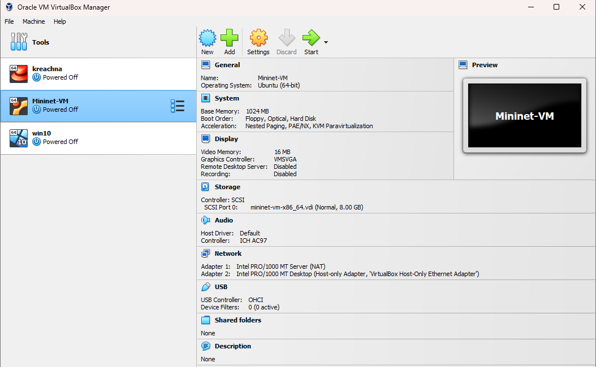
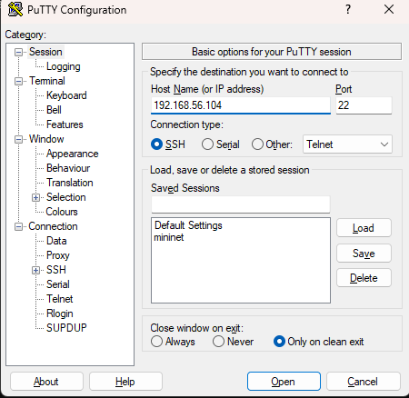
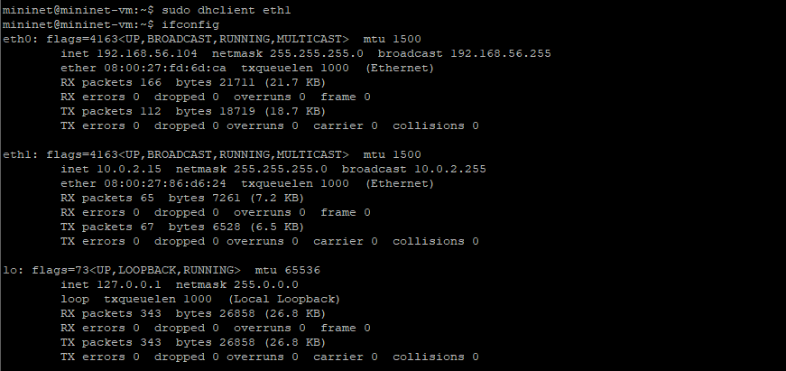
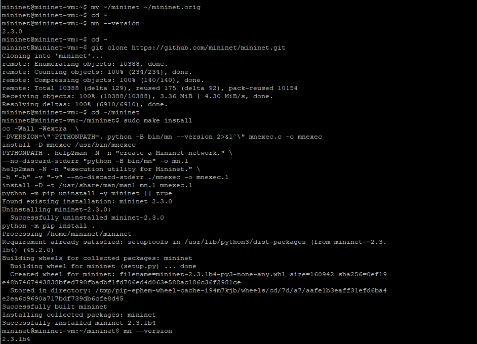
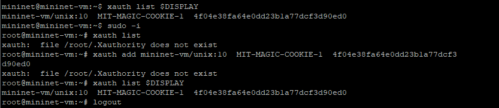
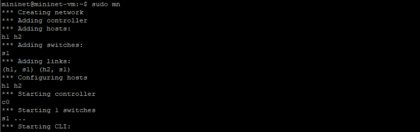
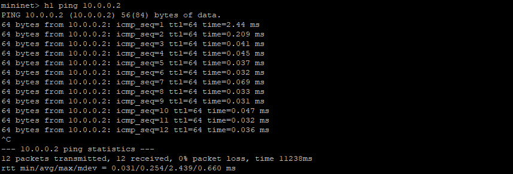
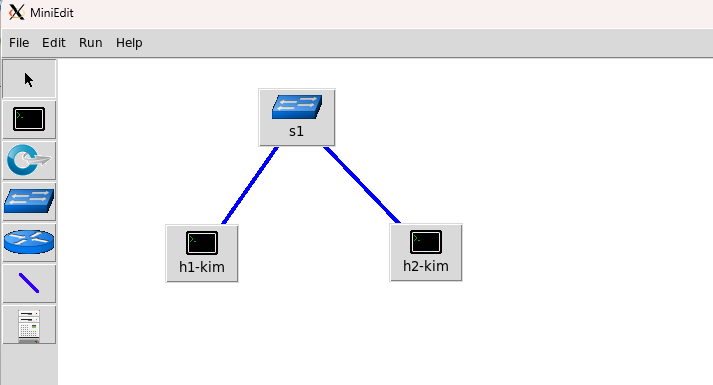
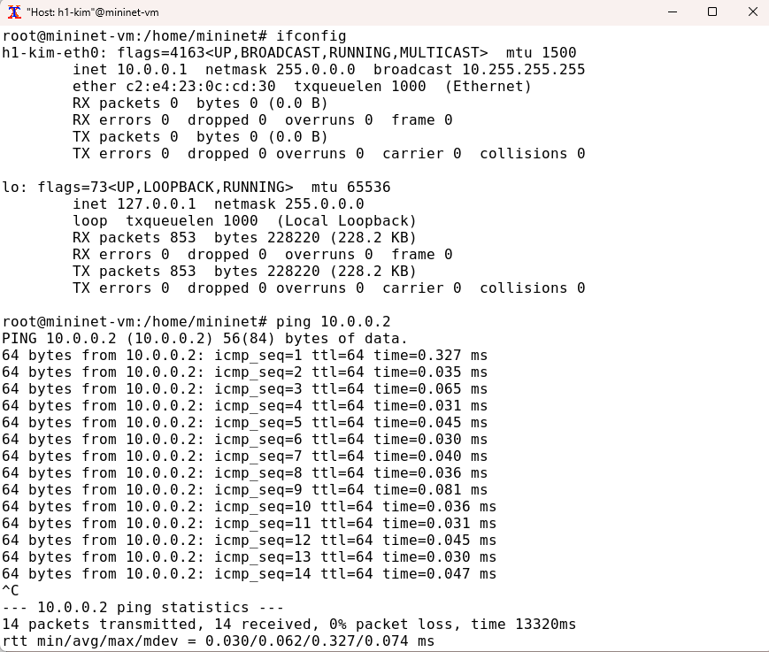

---
## Front matter
lang: ru-RU
title: Лабораторная работа №1
subtitle:  Введение в Mininet
author: |
	 Ким Реачна\inst{1}

institute: |
	\inst{1}Российский Университет Дружбы Народов

date: 14 ноября, 2023, Москва, Россия

## Formatting
mainfont: PT Serif
romanfont: PT Serif
sansfont: PT Sans
monofont: PT Mono
toc: false
slide_level: 2
theme: metropolis
header-includes: 
 - \metroset{progressbar=frametitle,sectionpage=progressbar,numbering=fraction}
 - '\makeatletter'
 - '\beamer@ignorenonframefalse'
 - '\makeatother'
aspectratio: 43
section-titles: true

---
# Цели и задачи

## Цель лабораторной работы

Основной целью работы является развёртывание в системе виртуализации mininet, знакомство с основными командами для работы с Mininet через командную строку и через графический интерфейс.

# Процесс выполнения лабораторной работы

## Настройка образа VirtualBox

{width=70% height=70%}

##  Подключение к машине

{width=70% height=70%}

## Настройка доступа к Интернет

{width=70% height=70%}

## Обновление версии Mininet

{width=70% height=70%}

##  Настройка соединения X11 для суперпользователя

{width=70% height=70%}

##  Работа с Mininet с помощью командной строки

{width=70% height=70%}

## Работа с Mininet с помощью командной строки

{width=70% height=70%}

##  Построение и эмуляция сети в Mininet с использованием графического интерфейса

{width=70% height=70%}

##  Построение и эмуляция сети в Mininet с использованием графического интерфейса

{width=70% height=70%}

# Выводы по проделанной работе

## Вывод

Я развернула в системе виртуализации mininet, знакомство с основными командами для работы с Mininet через командную строку и через графический интерфейс.
