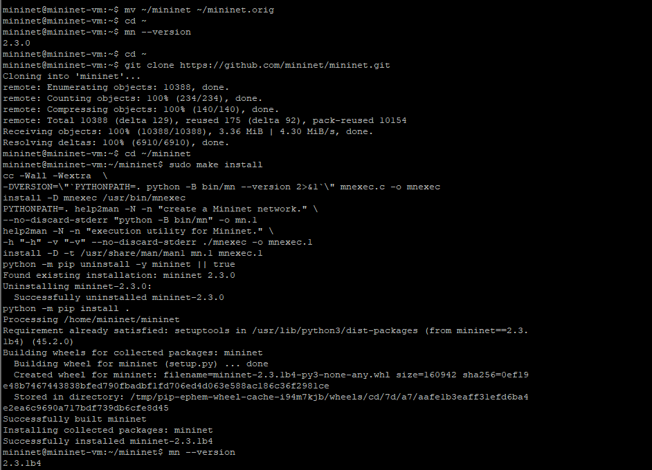

---
## Front matter
title: "Отчёт по лабораторной работе №1"
subtitle: "Введение в Mininet"
author: "Ким Реачна"

## Generic otions
lang: ru-RU
toc-title: "Содержание"

## Bibliography
bibliography: bib/cite.bib
csl: pandoc/csl/gost-r-7-0-5-2008-numeric.csl

## Pdf output format
toc: true # Table of contents
toc-depth: 2
lof: true # List of figures
fontsize: 12pt
linestretch: 1.5
papersize: a4
documentclass: scrreprt
## I18n polyglossia
polyglossia-lang:
  name: russian
  options:
	- spelling=modern
	- babelshorthands=true
polyglossia-otherlangs:
  name: english
## I18n babel
babel-lang: russian
babel-otherlangs: english
## Fonts
mainfont: PT Serif
romanfont: PT Serif
sansfont: PT Sans
monofont: PT Mono
mainfontoptions: Ligatures=TeX
romanfontoptions: Ligatures=TeX
sansfontoptions: Ligatures=TeX,Scale=MatchLowercase
monofontoptions: Scale=MatchLowercase,Scale=0.9
## Biblatex
biblatex: true
biblio-style: "gost-numeric"
biblatexoptions:
  - parentracker=true
  - backend=biber
  - hyperref=auto
  - language=auto
  - autolang=other*
  - citestyle=gost-numeric
## Pandoc-crossref LaTeX customization
figureTitle: "Рис."
listingTitle: "Листинг"
lofTitle: "Список иллюстраций"
lolTitle: "Листинги"
## Misc options
indent: true
header-includes:
  - \usepackage{indentfirst}
  - \usepackage{float} # keep figures where there are in the text
  - \floatplacement{figure}{H} # keep figures where there are in the text
---

# Цель работы

Основной целью работы является развёртывание в системе виртуализации (например, в VirtualBox) mininet, знакомство с основными командами для работы с Mininet через командную строку и через графический интерфейс.

# Выполнение лабораторной работы

1. Я установила необходимое оборудование для работы с Mininet из-под ОС Windows:

{ #fig:001 width=70% height=70%}

{ #fig:002 width=70% height=70%}

2. Запустите Xserver и запуск Putty: 

{ #fig:003 width=70% height=70%}

{ #fig:004 width=70% height=70%}

{ #fig:005 width=70% height=70%}

{ #fig:006 width=70% height=70%}

3. После подключения к виртуальной машине mininet посмотрите IP-адреса
машины, для доступа к сети Интернет должен быть активен адрес NAT: 10.0.0.x., Если активен только внутренний адрес машины вида 192.168.x.y, то активируйте второй интерфейс, набрав в командной строке:
```
sudo dhclient eth1
ifconfig
```
{ #fig:007 width=70% height=70%}

{ #fig:008 width=70% height=70%}

4. Для удобства дальнейшей работы установите mc: ```sudo apt install mc```

{ #fig:009 width=70% height=70%}

5. Для удобства дальнейшей работы добавьте для mininet указание на использование двух адаптеров при запуске. Для этого требуется перейти в режим суперпользователя и внести изменения в файл /etc/netplan/01-netcfg.yaml виртуальной машины mininet: ```sudo mcedit /etc/netplan/01-netcfg.yaml```

{width=70% height=70%}

6. Обновила версию mininet:
 
- В виртуальной машине mininet переименуйте предыдущую установку Mininet: ```mv ~/mininet ~/mininet.orig```

- Скачайте новую версию Mininet: 
```
cd ~
git clone https://github.com/mininet/mininet.git
```

- Обновите исполняемые файлы: 
```
cd ~/mininet
sudo make install
```

- Проверьте номер установленной версии mininet: ```mn --version```

{width=70% height=70%}

7. Внесение изменений в файл ```/etc/X11/app-defaults/XTerm```:  Для этого можно воспользоваться следующей командой: ```sudo mcedit /etc/X11/app-defaults/XTerm``` и затем в конце файла добавить строки: 
```
xterm*faceName: Monospace
xterm*faceSize: 12
```
{width=70% height=70%}

8. Скопируйте значение куки (MIT magic cookie)1 пользователя mininet в файл
для пользователя root: 

{width=70% height=70%}

9. Вызов Mininet с использованием топологии по умолчани:
- Для запуска минимальной топологии введите в командной строке: ```sudo mn```

- Для отображения списка команд интерфейса командной строки Mininet и примеров их использования введите команду в интерфейсе командной строки Mininet: ```help```

- Для отображения доступных узлов введите: ```nodes```
- Введите команду net в интерфейсе командной строки Mininet, чтобы просмотреть доступные линки: ```net```

{width=70% height=70%}

- Отображение информации о конфигурации сетевого интерфейса для хоста h1: ```h1 config```

{width=70% height=70%}

10. Проверка соединения между хостами h1 и h2 использовать команду ping ```h1 ping 10.0.0.2``` и остановка эмуляции использовать команду ```exit```

{width=70% height=70%}

{width=70% height=70%}

11. Построение топологии сети: Добавьте два хоста и один коммутатор и Настройте IP-адреса на хостах h1 и h2. Для хоста h1 укажите IP-адрес 10.0.0.1/8, а для хоста h2 — 10.0.0.2/8: ```sudo ~/mininet/mininet/examples/miniedit.py```

{width=70% height=70%}

{width=70% height=70%}

{width=70% height=70%}

12. Проверка связности.

{width=70% height=70%}

13. Автоматическое назначение IP-адресов

{width=70% height=70%}

{width=70% height=70%}

Интерфейс h1-eth0 на узле h1 теперь имеет IP-адрес 15.0.0.1 и маску подсети 255.0.0.0.

12. Сохранение и загрузка топологии Mininet.

{width=70% height=70%}

{width=70% height=70%}


# Вывод

Я развернула в системе виртуализации mininet, знакомство с основными командами для работы с Mininet через командную строку и через графический интерфейс.
