---
## Front matter
lang: ru-RU
title: Лабораторная работа №2
subtitle:  Измерение и тестирование пропускной способности сети. Интерактивный эксперимент
author: |
	 Ким Реачна\inst{1}

institute: |
	\inst{1}Российский Университет Дружбы Народов

date: 21 ноября, 2023, Москва, Россия

## Formatting
mainfont: PT Serif
romanfont: PT Serif
sansfont: PT Sans
monofont: PT Mono
toc: false
slide_level: 2
theme: metropolis
header-includes: 
 - \metroset{progressbar=frametitle,sectionpage=progressbar,numbering=fraction}
 - '\makeatletter'
 - '\beamer@ignorenonframefalse'
 - '\makeatother'
aspectratio: 43
section-titles: true

---
# Цели и задачи

## Цель лабораторной работы

Основной целью работы является знакомство с инструментом для измерения пропускной способности сети в режиме реального времени — iPerf3, а также получение навыков проведения интерактивного эксперимента по измерению пропускной способности моделируемой сети в среде Mininet.

## Задание

1. Установить на виртуальную машину mininet iPerf3 и дополнительное программное обеспечения для визуализации и обработки данных.

2. Провести ряд интерактивных экспериментов по измерению пропускной способности с помощью iPerf3 с построением графиков.

# Процесс выполнения лабораторной работы

## Установить mininet iPerf3 и дополнительное программное обеспечения

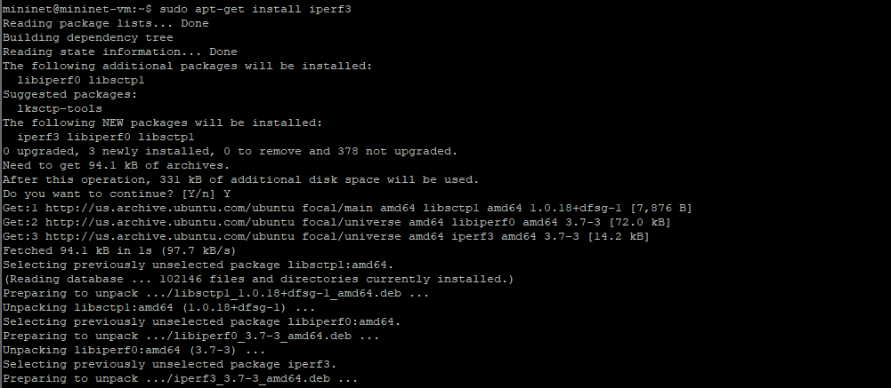{width=80% height=80% }

##  Интерактивные эксперименты

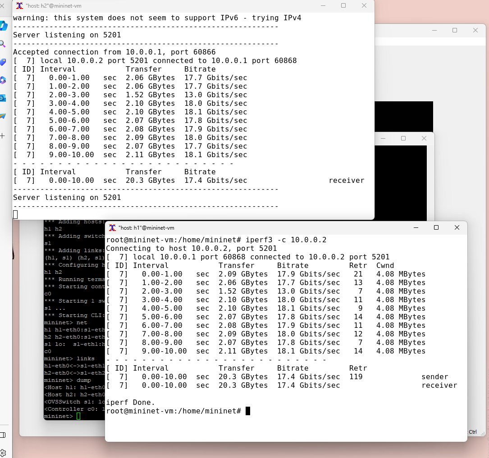{width=70% height=70%}

## Интерактивные эксперименты

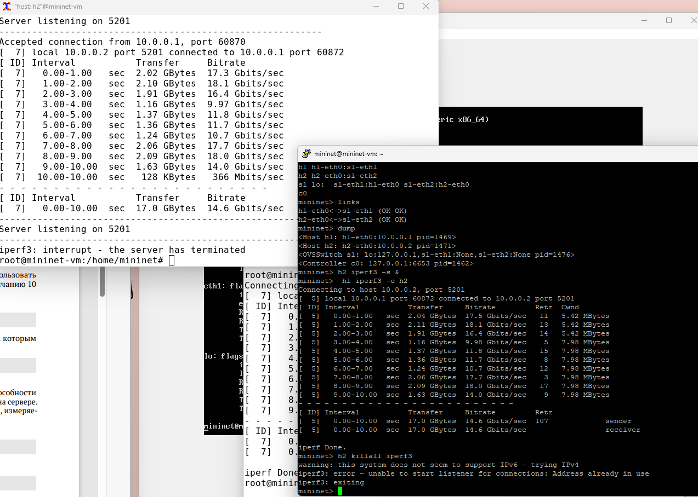{width=70% height=70%}

## Интерактивные эксперименты

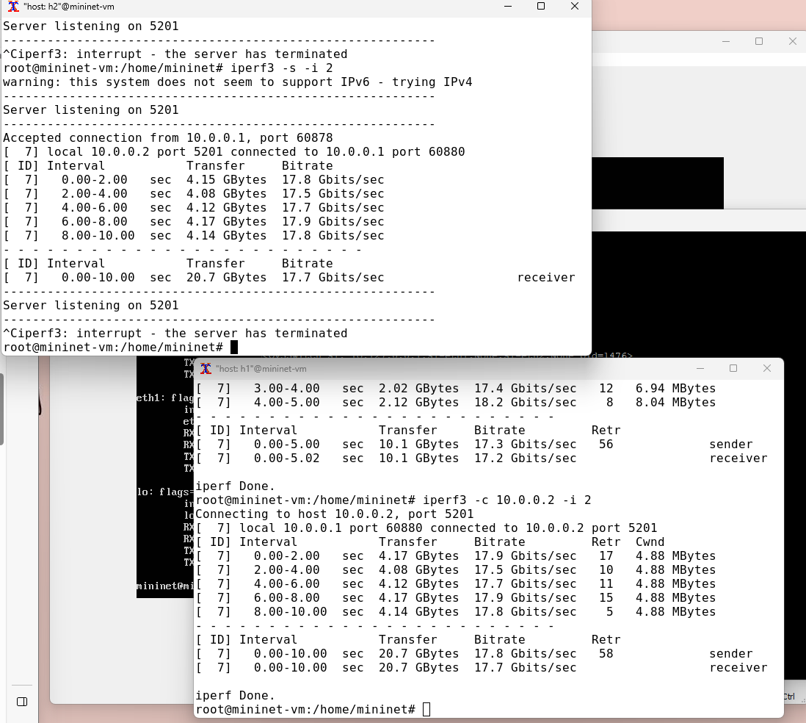{width=70% height=70%}

## Интерактивные эксперименты

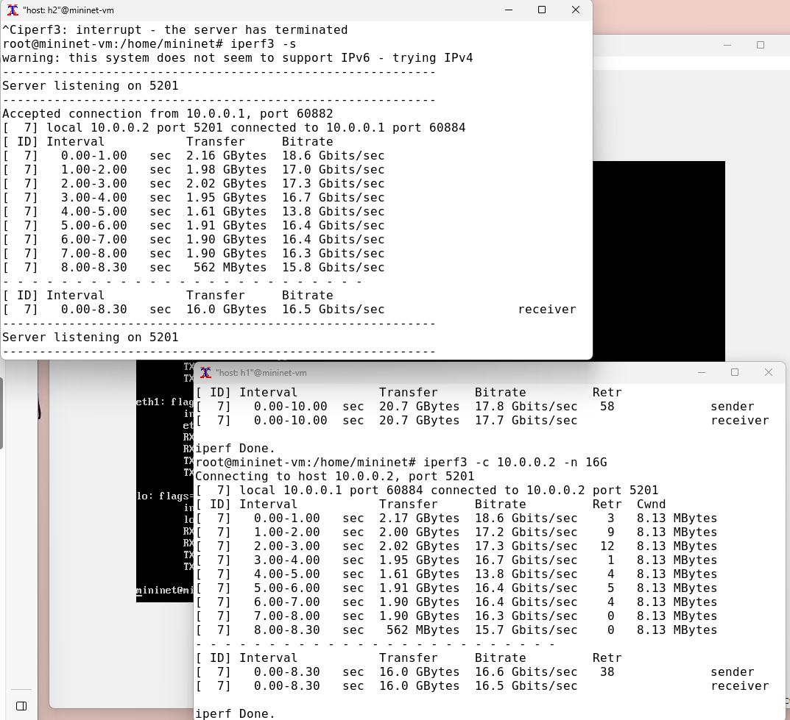{width=70% height=70%}

## Интерактивные эксперименты

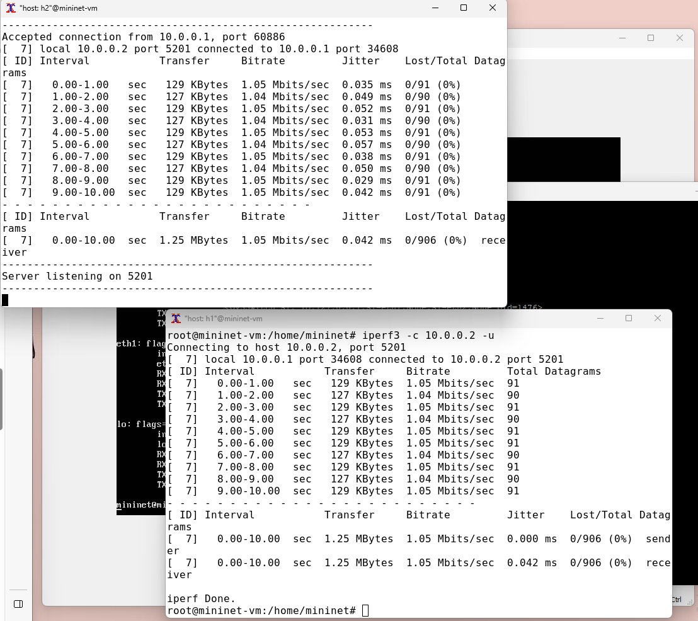{width=70% height=70%}

## Интерактивные эксперименты

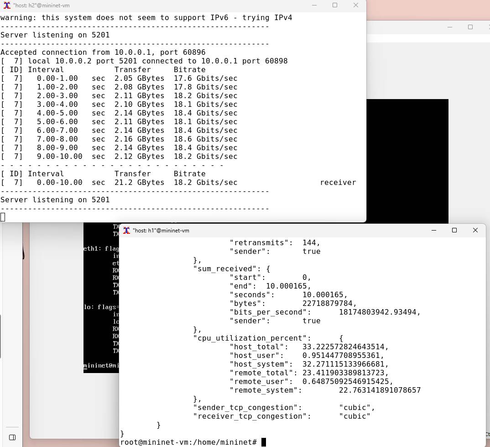{width=70% height=70%}

## Визуализация результатов эксперимента

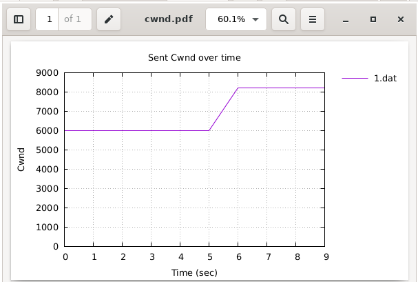{width=70% height=70%}

## Визуализация результатов эксперимента

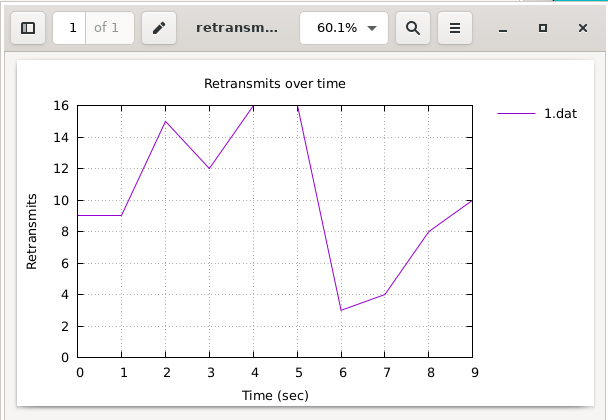{width=70% height=70%}

## Визуализация результатов эксперимента

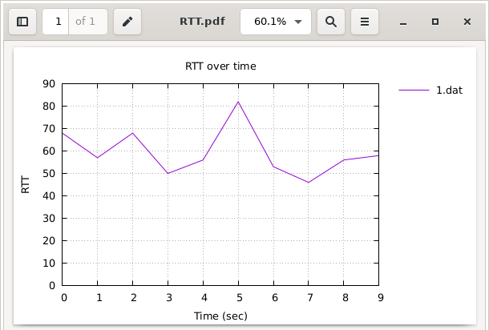{width=70% height=70%}

## Визуализация результатов эксперимента

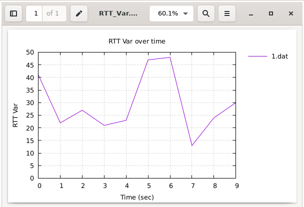{width=70% height=70%}

## Визуализация результатов эксперимента

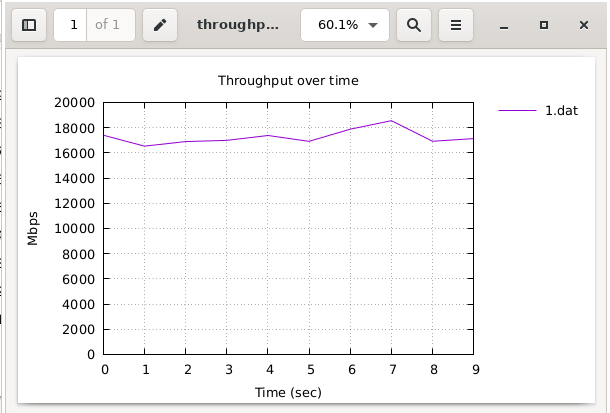{width=70% height=70%}

## Визуализация результатов эксперимента

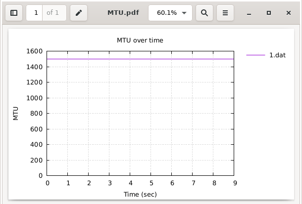{width=70% height=70%}

## Визуализация результатов эксперимента

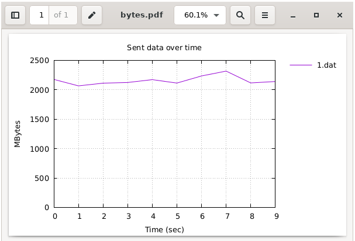{width=70% height=70%}

# Выводы по проделанной работе

## Вывод

Я познакомилась с инструментом для измерения пропускной способности сети в режиме реального времени — iPerf3, а также получение навыков проведения интерактивного эксперимента по измерению пропускной способности моделируемой сети в среде Mininet.
