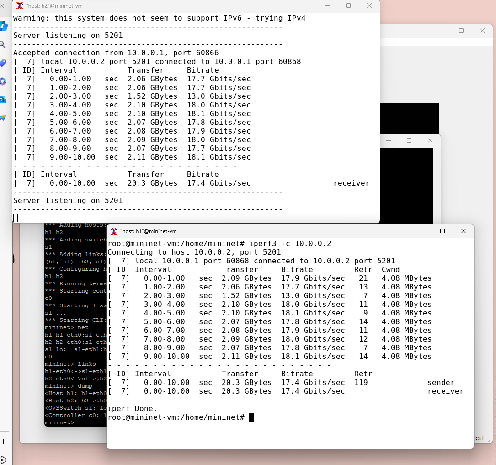

---
## Front matter
title: "Отчёт по лабораторной работе №2"
subtitle: "Измерение и тестирование пропускной способности сети. Интерактивный эксперимент"
author: "Ким Реачна"

## Generic otions
lang: ru-RU
toc-title: "Содержание"

## Bibliography
bibliography: bib/cite.bib
csl: pandoc/csl/gost-r-7-0-5-2008-numeric.csl

## Pdf output format
toc: true # Table of contents
toc-depth: 2
lof: true # List of figures
fontsize: 12pt
linestretch: 1.5
papersize: a4
documentclass: scrreprt
## I18n polyglossia
polyglossia-lang:
  name: russian
  options:
	- spelling=modern
	- babelshorthands=true
polyglossia-otherlangs:
  name: english
## I18n babel
babel-lang: russian
babel-otherlangs: english
## Fonts
mainfont: PT Serif
romanfont: PT Serif
sansfont: PT Sans
monofont: PT Mono
mainfontoptions: Ligatures=TeX
romanfontoptions: Ligatures=TeX
sansfontoptions: Ligatures=TeX,Scale=MatchLowercase
monofontoptions: Scale=MatchLowercase,Scale=0.9
## Biblatex
biblatex: true
biblio-style: "gost-numeric"
biblatexoptions:
  - parentracker=true
  - backend=biber
  - hyperref=auto
  - language=auto
  - autolang=other*
  - citestyle=gost-numeric
## Pandoc-crossref LaTeX customization
figureTitle: "Рис."
listingTitle: "Листинг"
lofTitle: "Список иллюстраций"
lolTitle: "Листинги"
## Misc options
indent: true
header-includes:
  - \usepackage{indentfirst}
  - \usepackage{float} # keep figures where there are in the text
  - \floatplacement{figure}{H} # keep figures where there are in the text
---

# Цель работы

Основной целью работы является знакомство с инструментом для измерения пропускной способности сети в режиме реального времени — iPerf3, а также получение навыков проведения интерактивного эксперимента по измерению пропускной способности моделируемой сети в среде Mininet.

# Выполнение лабораторной работы

##    Установка необходимого программного обеспечения

1. Запустите виртуальную среду с mininet.

2. Из основной ОС подключитесь к виртуальной машине, после подключения к виртуальной машине mininet посмотрите IP-адреса машины:

{width=70% height=70%}

3. Обновите репозитории программного обеспечения на виртуальной машине:

{width=70% height=70%}

4. Установите iperf3:

{width=70% height=70%}

5. Установите необходимое дополнительное программное обеспечение на виртуальную машину:

{width=70% height=70%}

6. Разверните iperf3_plotter. Для этого:

- перейдите во временный каталог и скачайте репозиторий
- установите iperf3_plotter

{width=70% height=70%}

## Интерактивные эксперименты

1. Задайте простейшую топологию, состоящую из двух хостов и коммутатора с назначенной по умолчанию mininet сетью 10.0.0.0/8, и посмотрите параметры запущенной в интерактивном режиме топологии:

{width=70% height=70%}

2. Проведите простейший интерактивный эксперимент по измерению пропускной способности с помощью iPerf3:

{width=70% height=70%}

3. Проведите аналогичный эксперимент в интерфейсе mininet.

{width=70% height=70%}

4. Для указания iPerf3 периода времени для передачи можно использовать ключ ```-t``` (или --time) — время в секундах для передачи (по умолчанию 10 секунд):

{width=70% height=70%}

5. Настройте клиент iPerf3 для выполнения теста пропускной способностис 2-секундным интервалом времени отсчёта как на клиенте, так и на сервере. Используйте опцию ```-i``` для установки интервала между отсчётами, измеряемого в секундах:

{width=70% height=70%}

6. Задайте на клиенте iPerf3 отправку определённого объёма данных. Используйте опцию ```-n``` для установки количества байт для передачи:

{width=70% height=70%}

7. Измените в тесте измерения пропускной способности iPerf3 протокол передачи данных с TCP (установлен по умолчанию) на UDP. iPerf3 автоматически определяет протокол транспортного уровня на стороне сервера. Для изменения протокола используйте опцию ```-u``` на стороне клиента iPerf3:

{width=70% height=70%}

8. В тесте измерения пропускной способности iPerf3 измените номер порта для отправки/получения пакетов или датаграмм через указанный порт. Используйте для этого опцию -p:

{width=70% height=70%}

9. По умолчанию после запуска сервер iPerf3 постоянно прослушивает входящие соединения. В тесте измерения пропускной способности iPerf3 задайте для сервера параметр обработки данных только от одного клиента с остановкой сервера по завершении теста. Для этого используйте опцию ```-1``` на сервере iPerf3:

{width=70% height=70%}

Видим что после завершения этого теста сервер iPerf3 немедленно останавливается.

10. Экспортируйте результаты теста измерения пропускной способности iPerf3 в файл JSON:

- В виртуальной машине mininet создайте каталог для работы над проектом: ```mkdir -p ~/work/lab_iperf3```

{width=70% height=70%}

- Экспортируйте вывод результатов теста в файл, перенаправив стандартный вывод в файл:

{width=70% height=70%}

11. Визуализируйте результаты эксперимента:

-  Проверьте и скорректируйте права доступа к файлу JSON:
- Сгенерируйте выходные данные для файла JSON iPerf3: ```plot_iperf.sh iperf_results.json```
- Убедитесь, что файлы с данными и графиками сформировались:

{width=70% height=70%}

{width=70% height=70%}

{width=70% height=70%}

{width=70% height=70%}

{width=70% height=70%}

{width=70% height=70%}

{width=70% height=70%}

{width=70% height=70%}

# Вывод

Я познакомилась с инструментом для измерения пропускной способности сети в режиме реального времени — iPerf3, а также получение навыков проведения интерактивного эксперимента по измерению пропускной способности моделируемой сети в среде Mininet.
