---
## Front matter
lang: ru-RU
title: Лабораторная работа №3
subtitle:  Измерение и тестирование пропускной способности сети. Воспроизводимый эксперимент
author: |
	 Ким Реачна\inst{1}

institute: |
	\inst{1}Российский Университет Дружбы Народов

date: 29 ноября, 2023, Москва, Россия

## Formatting
mainfont: PT Serif
romanfont: PT Serif
sansfont: PT Sans
monofont: PT Mono
toc: false
slide_level: 2
theme: metropolis
header-includes: 
 - \metroset{progressbar=frametitle,sectionpage=progressbar,numbering=fraction}
 - '\makeatletter'
 - '\beamer@ignorenonframefalse'
 - '\makeatother'
aspectratio: 43
section-titles: true

---
# Цели и задачи

## Цель лабораторной работы

Основной целью работы является знакомство с инструментом для измерения пропускной способности сети в режиме реального времени — iPerf3, а также получение навыков проведения воспроизводимого эксперимента по измерению пропускной способности моделируемой сети в среде Mininet.

## Задание

1. Воспроизвести посредством API Mininet эксперименты по измерению пропускной способности с помощью iPerf3.

2. Построить графики по проведённому эксперименту.

# Процесс выполнения лабораторной работы

## Скрипт lab_iperf3_topo.py

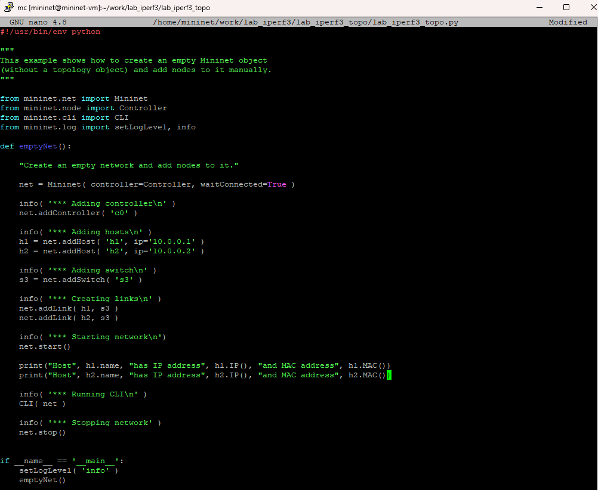{width=80% height=80%}

## Запуск скрипта lab_iperf3_topo.py

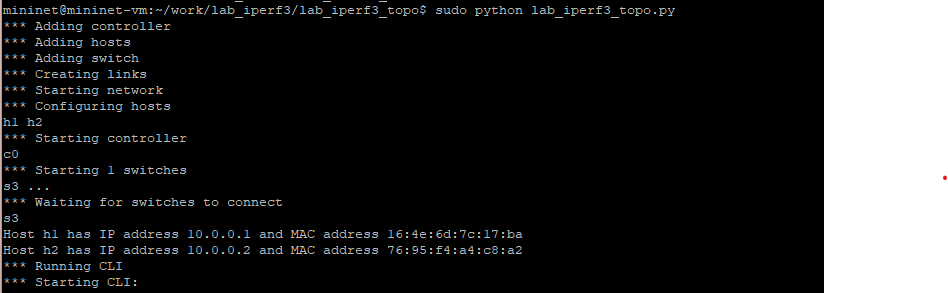{width=80% height=80%}

## Скрипт lab_iperf3_topo2.py

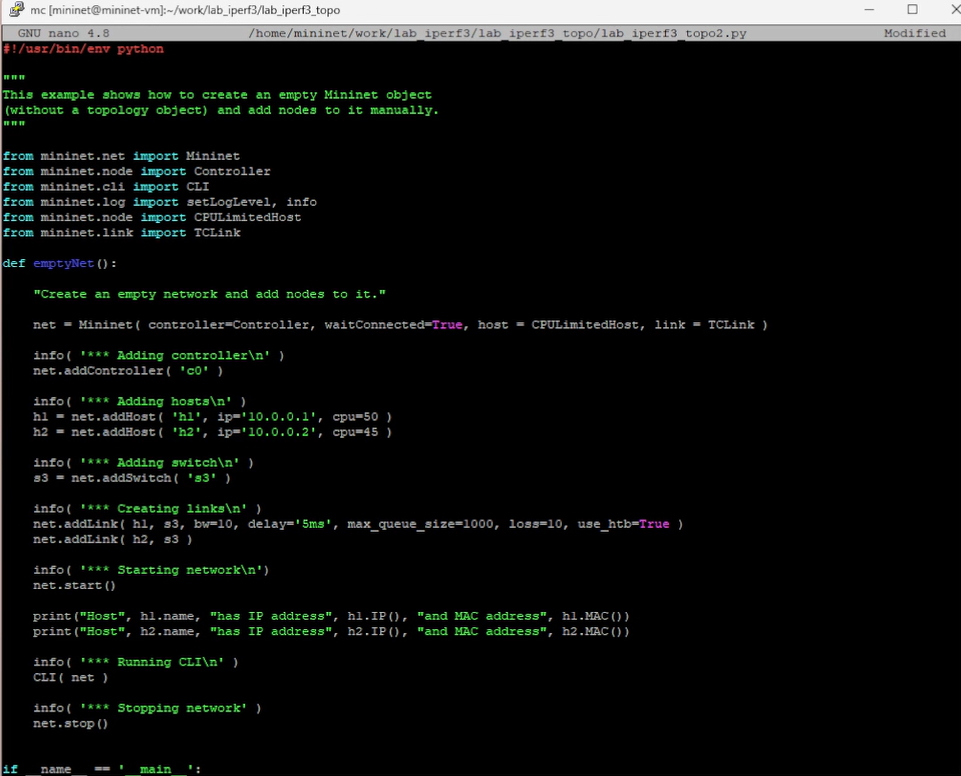{width=80% height=80%}

## Запуск скрипта lab_iperf3_topo2.py

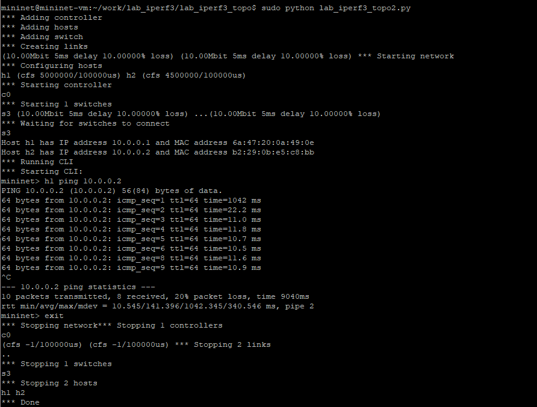{width=80% height=80%}

## Скрипт lab_iperf3.py

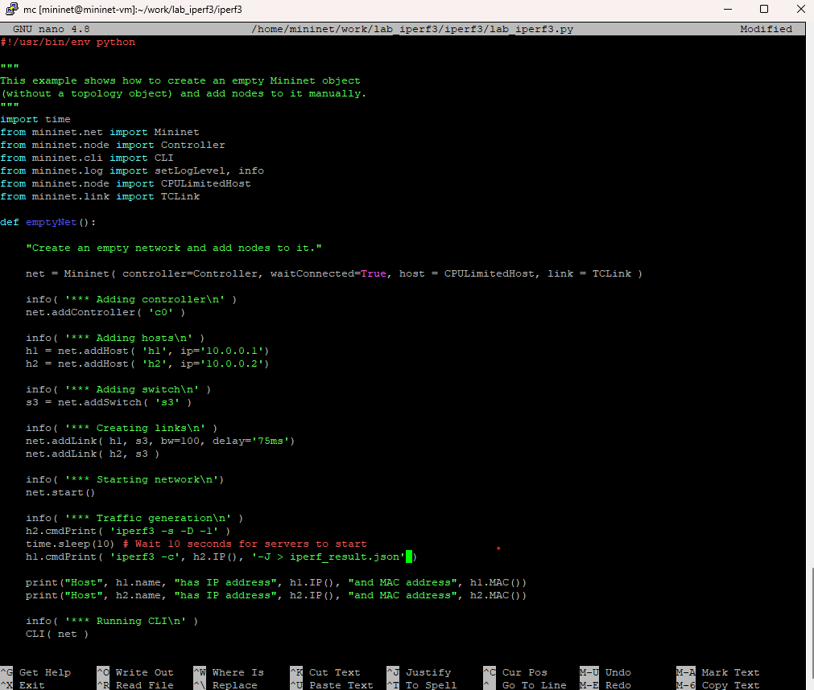{width=80% height=80%}

## Запуск скрипта lab_iperf3.py

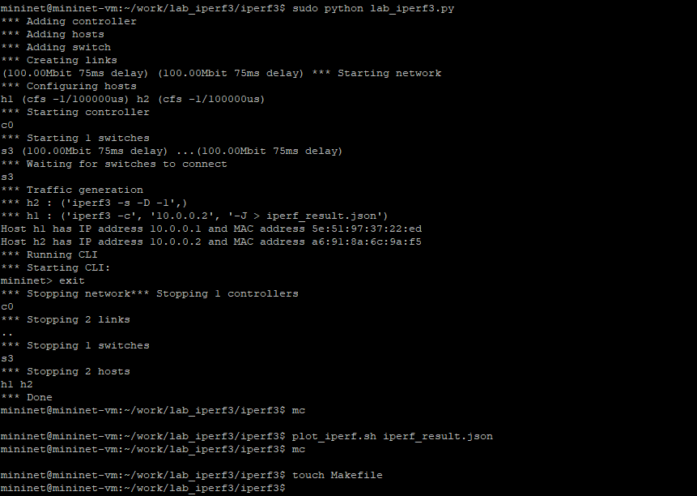{width=80% height=80%}

## Makefile

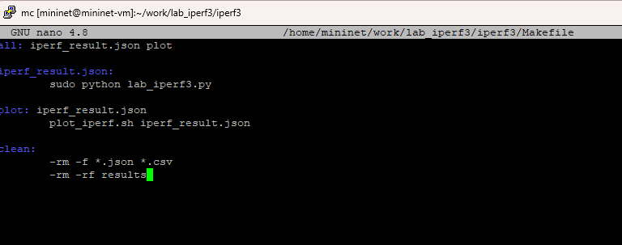{width=80% height=80%}

## Проверка корректность отработки Makefile

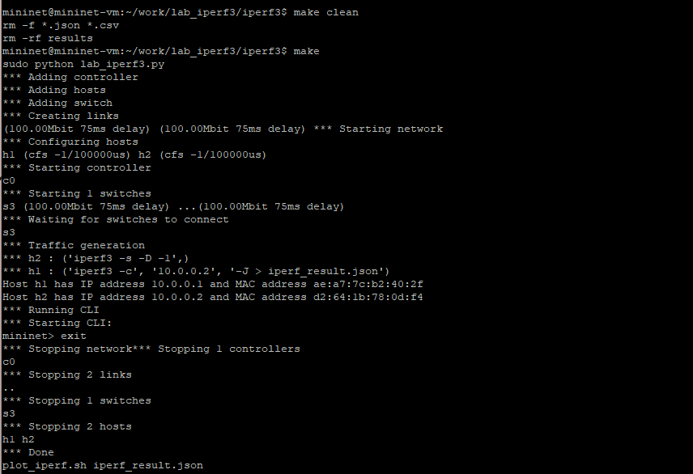{width=80% height=80%}

## Визуализация результатов эксперимента

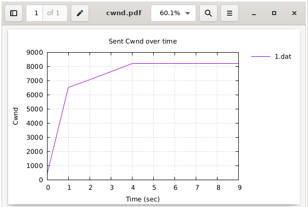{width=80% height=80%}

## Визуализация результатов эксперимента

{width=80% height=80%}

## Визуализация результатов эксперимента

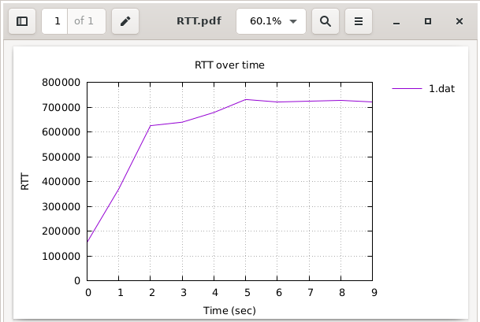{width=80% height=80%}

## Визуализация результатов эксперимента

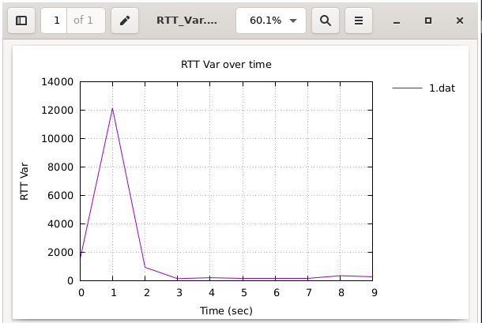{width=80% height=80%}

## Визуализация результатов эксперимента

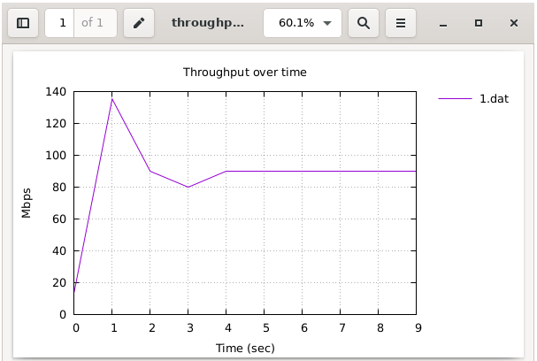{width=80% height=80%}

## Визуализация результатов эксперимента

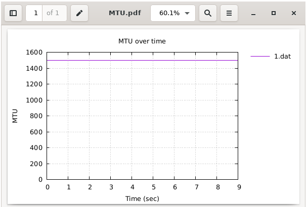{width=80% height=80%}

## Визуализация результатов эксперимента

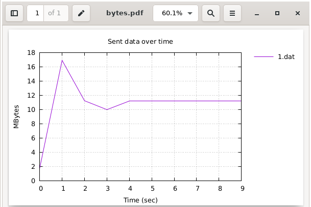{width=80% height=80%}

# Выводы по проделанной работе

## Вывод

Я познакомилась  с инструментом для измерения пропускной способности сети в режиме реального времени — iPerf3, а также получение навыков проведения воспроизводимого эксперимента по измерению пропускной способности моделируемой сети в среде Mininet.