---
## Front matter
title: "Отчёт по лабораторной работе №3"
subtitle: "Измерение и тестирование пропускной способности сети. Воспроизводимый эксперимент"
author: "Ким Реачна"

## Generic otions
lang: ru-RU
toc-title: "Содержание"

## Bibliography
bibliography: bib/cite.bib
csl: pandoc/csl/gost-r-7-0-5-2008-numeric.csl

## Pdf output format
toc: true # Table of contents
toc-depth: 2
lof: true # List of figures
fontsize: 12pt
linestretch: 1.5
papersize: a4
documentclass: scrreprt
## I18n polyglossia
polyglossia-lang:
  name: russian
  options:
	- spelling=modern
	- babelshorthands=true
polyglossia-otherlangs:
  name: english
## I18n babel
babel-lang: russian
babel-otherlangs: english
## Fonts
mainfont: PT Serif
romanfont: PT Serif
sansfont: PT Sans
monofont: PT Mono
mainfontoptions: Ligatures=TeX
romanfontoptions: Ligatures=TeX
sansfontoptions: Ligatures=TeX,Scale=MatchLowercase
monofontoptions: Scale=MatchLowercase,Scale=0.9
## Biblatex
biblatex: true
biblio-style: "gost-numeric"
biblatexoptions:
  - parentracker=true
  - backend=biber
  - hyperref=auto
  - language=auto
  - autolang=other*
  - citestyle=gost-numeric
## Pandoc-crossref LaTeX customization
figureTitle: "Рис."
listingTitle: "Листинг"
lofTitle: "Список иллюстраций"
lolTitle: "Листинги"
## Misc options
indent: true
header-includes:
  - \usepackage{indentfirst}
  - \usepackage{float} # keep figures where there are in the text
  - \floatplacement{figure}{H} # keep figures where there are in the text
---

# Цель работы

Основной целью работы является знакомство с инструментом для измерения пропускной способности сети в режиме реального времени — iPerf3, а также получение навыков проведения воспроизводимого эксперимента по измерению пропускной способности моделируемой сети в среде Mininet.

# Выполнение лабораторной работы

1. Создание подкаталога и копирование скрипта lab_iperf3_topo.py для запуска моделирования, затем изменение скрипта для вывода отображаемой информации о хосте, IP-адресе и MAC-адресе:

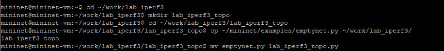{width=80% height=80%}

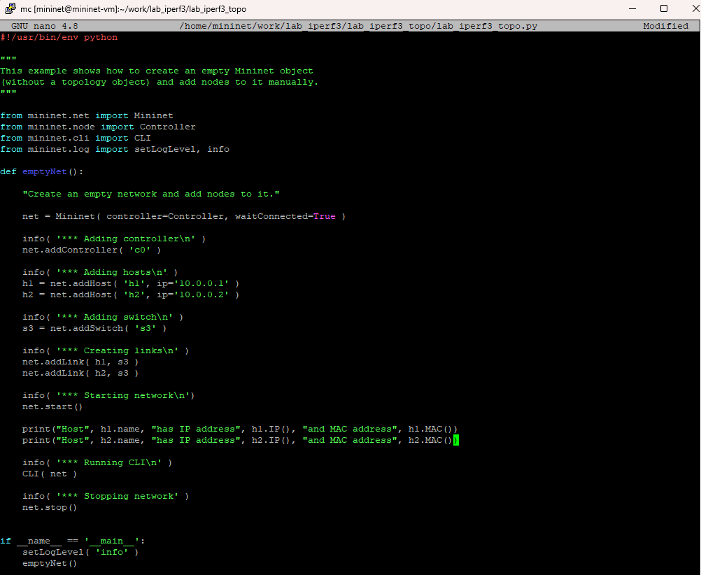{width=80% height=80%}

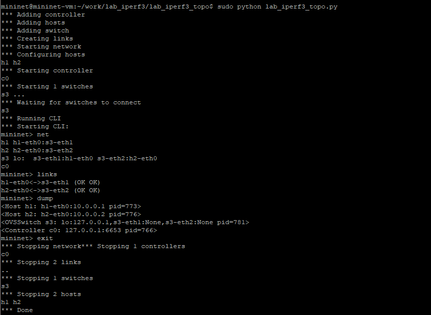{width=80% height=80%}

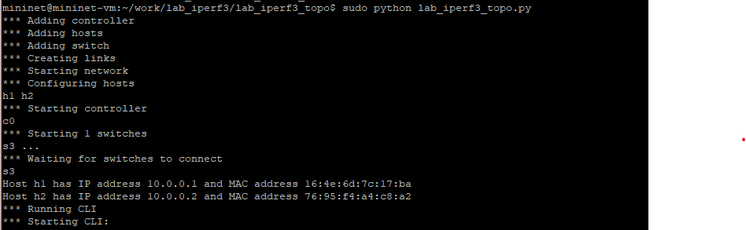{width=80% height=80%}

2. Изменение тополгию, скопировав в lab_iperf3_topo2.py, указание на использование ограничения производительности и изоляции, изменение функцию задания параметров виртуального хоста h1 и h2 и изменение функцию параметров соединения между хостом h1 и коммутатором s3:

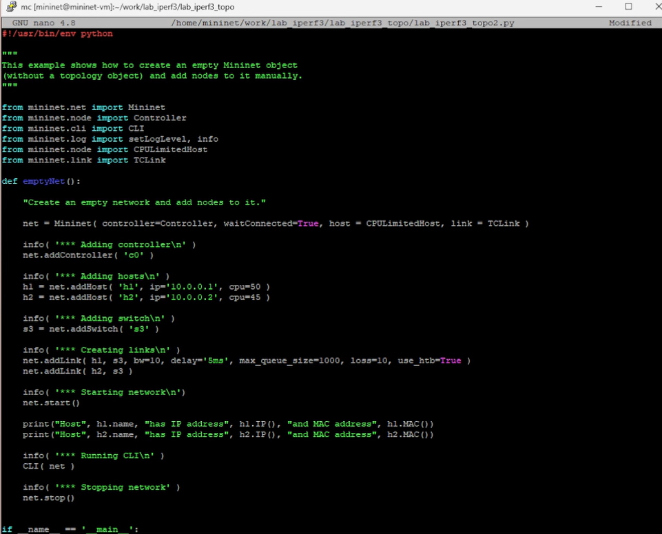{width=80% height=80%}

- Запуск на отработку сначала скрипт lab_iperf3_topo2.py, затем lab_iperf3_topo.py

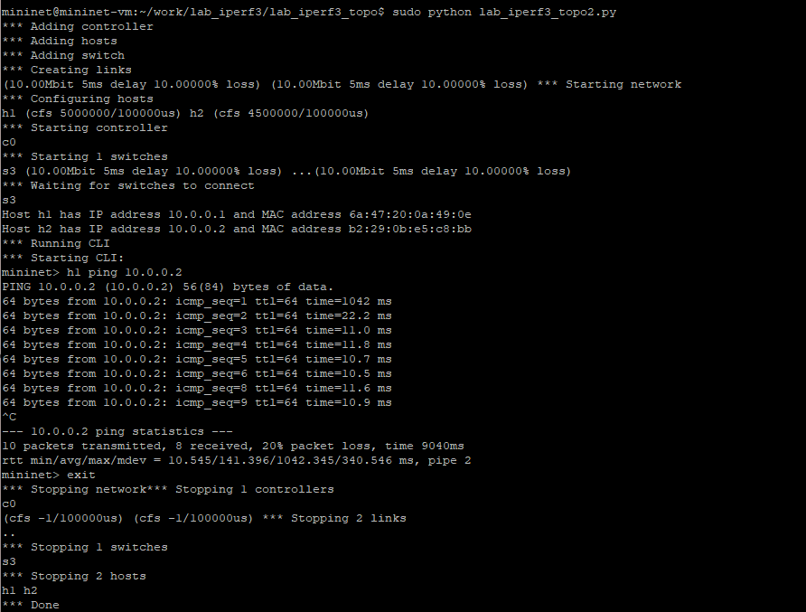{width=80% height=80%}

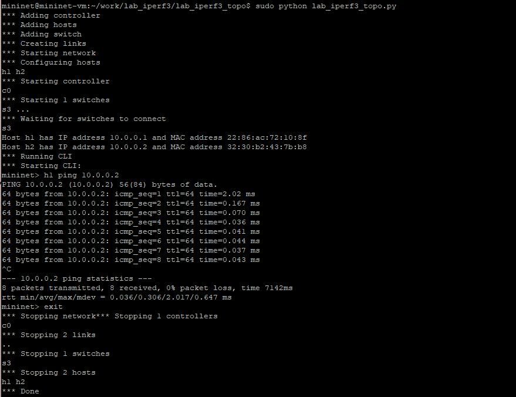{width=80% height=80%}

3. Построение графика: изменение топологии, копирование в lab_iperf3.py , изменение параметров, создание Makefile для запуска всего эксперимента:

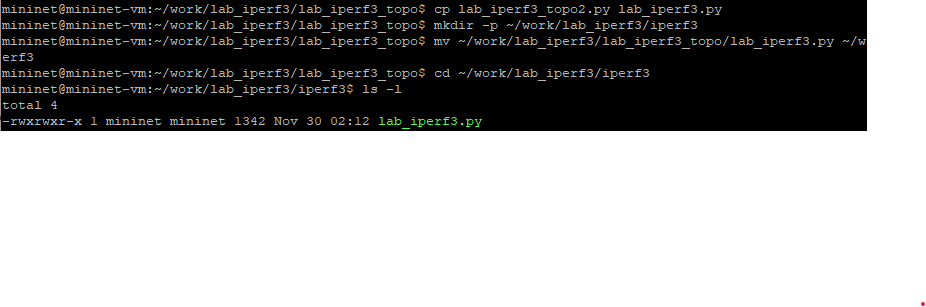{width=80% height=80%}

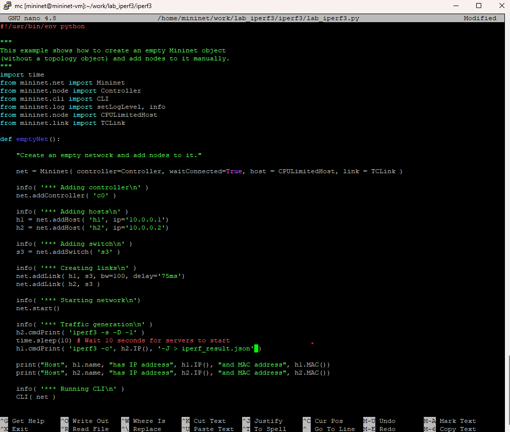{width=80% height=80%}

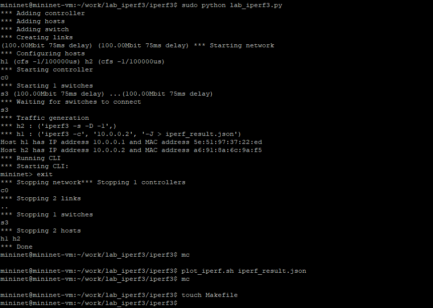{width=80% height=80%}

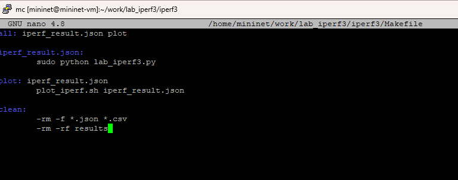{width=80% height=80%}

- Проверка корректность отработки Makefile

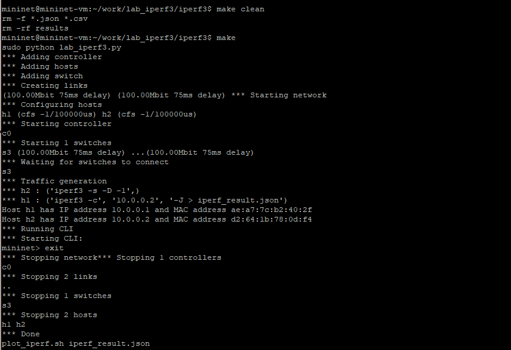{width=80% height=80%}

4. Результат построения графика

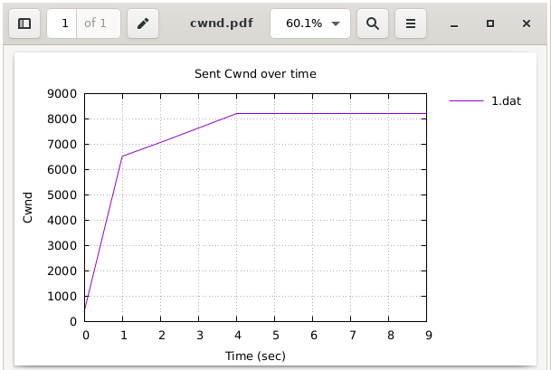{width=80% height=80%}

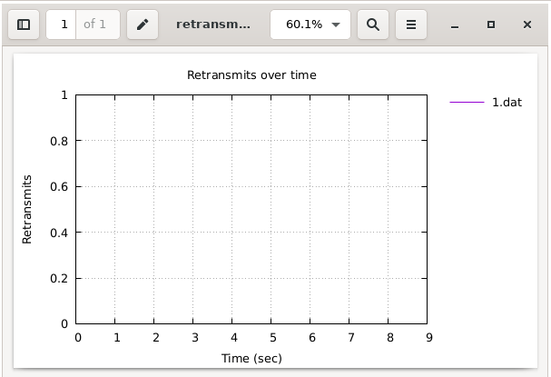{width=80% height=80%}

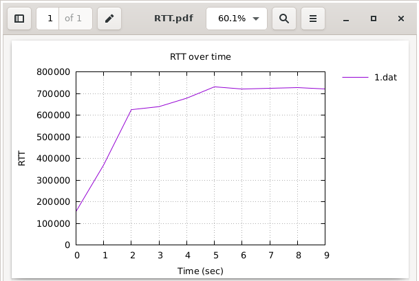{width=80% height=80%}

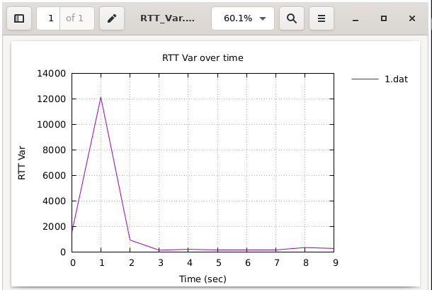{width=80% height=80%}

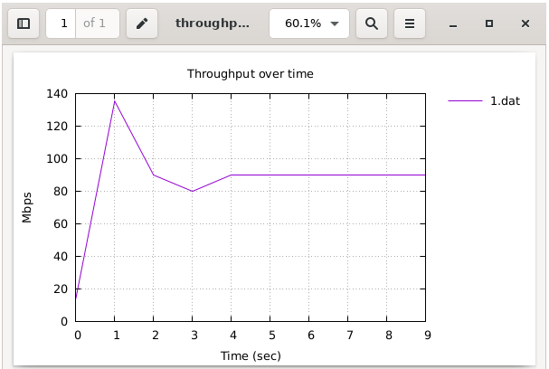{width=80% height=80%}

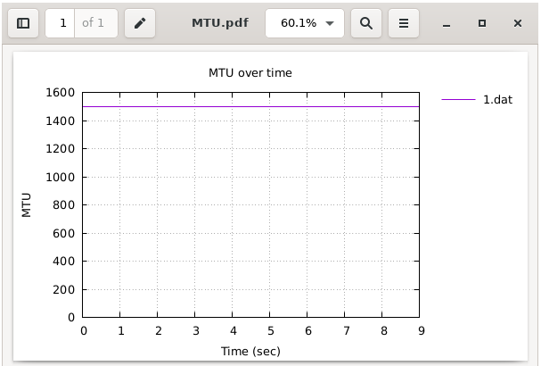{width=80% height=80%}

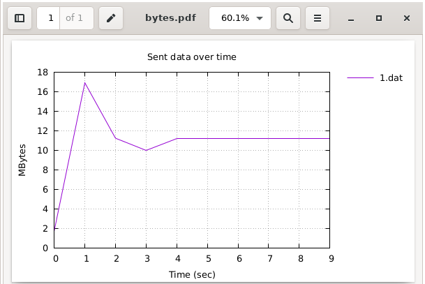{width=80% height=80%}

# Листинги  программы

- Скрипт lab_iperf3_topo.py

```python
#!/usr/bin/env python

"""
This example shows how to create an empty Mininet object
(without a topology object) and add nodes to it manually.
"""

from mininet.net import Mininet
from mininet.node import Controller
from mininet.cli import CLI
from mininet.log import setLogLevel, info

def emptyNet():

    "Create an empty network and add nodes to it."

    net = Mininet( controller=Controller, waitConnected=True )

    info( '*** Adding controller\n' )
    net.addController( 'c0' )

    info( '*** Adding hosts\n' )
    h1 = net.addHost( 'h1', ip='10.0.0.1' )
    h2 = net.addHost( 'h2', ip='10.0.0.2' )

    info( '*** Adding switch\n' )
    s3 = net.addSwitch( 's3' )

    info( '*** Creating links\n' )
    net.addLink( h1, s3 )
    net.addLink( h2, s3 )

    info( '*** Starting network\n')
    net.start()

    print("Host", h1.name, "has IP address", h1.IP(), 
    "and MAC address", h1.MAC())
    print("Host", h2.name, "has IP address", h2.IP(), 
    "and MAC address", h2.MAC())

    info( '*** Running CLI\n' )
    CLI( net )

    info( '*** Stopping network' )
    net.stop()

if __name__ == '__main__':
    setLogLevel( 'info' )
    emptyNet()
```

- Скрипт lab_iperf3_topo2.py

```python
#!/usr/bin/env python

"""
This example shows how to create an empty Mininet object
(without a topology object) and add nodes to it manually.
"""

from mininet.net import Mininet
from mininet.node import Controller
from mininet.cli import CLI
from mininet.log import setLogLevel, info
from mininet.node import CPULimitedHost
from mininet.link import TCLink

def emptyNet():

    "Create an empty network and add nodes to it."

    net = Mininet( controller=Controller, waitConnected=True, 
    host = CPULimitedHost, link = TCLink )

    info( '*** Adding controller\n' )
    net.addController( 'c0' )

    info( '*** Adding hosts\n' )
    h1 = net.addHost( 'h1', ip='10.0.0.1', cpu=50 )
    h2 = net.addHost( 'h2', ip='10.0.0.2', cpu=45 )

    info( '*** Adding switch\n' )
    s3 = net.addSwitch( 's3' )

    info( '*** Creating links\n' )
    net.addLink( h1, s3, bw=10, delay='5ms', max_queue_size=1000, 
    loss=10, use_htb=True )
    net.addLink( h2, s3 )

    info( '*** Starting network\n')
    net.start()

    print("Host", h1.name, "has IP address", h1.IP(), 
    "and MAC address", h1.MAC())
    print("Host", h2.name, "has IP address", h2.IP(), 
    "and MAC address", h2.MAC())

    info( '*** Running CLI\n' )
    CLI( net )

    info( '*** Stopping network' )
    net.stop()

if __name__ == '__main__':
    setLogLevel( 'info' )
    emptyNet()
```

- Скрипт lab_iperf3.py

```python
#!/usr/bin/env python

"""
This example shows how to create an empty Mininet object
(without a topology object) and add nodes to it manually.
"""
import time
from mininet.net import Mininet
from mininet.node import Controller
from mininet.cli import CLI
from mininet.log import setLogLevel, info
from mininet.node import CPULimitedHost
from mininet.link import TCLink

def emptyNet():

    "Create an empty network and add nodes to it."

    net = Mininet( controller=Controller, waitConnected=True, 
    host = CPULimitedHost, link = TCLink )

    info( '*** Adding controller\n' )
    net.addController( 'c0' )

    info( '*** Adding hosts\n' )
    h1 = net.addHost( 'h1', ip='10.0.0.1')
    h2 = net.addHost( 'h2', ip='10.0.0.2')

    info( '*** Adding switch\n' )
    s3 = net.addSwitch( 's3' )

    info( '*** Creating links\n' )
    net.addLink( h1, s3, bw=100, delay='75ms')
    net.addLink( h2, s3 )

    info( '*** Starting network\n')
    net.start()

    info( '*** Traffic generation\n' )
    h2.cmdPrint( 'iperf3 -s -D -1' )
    time.sleep(10) # Wait 10 seconds for servers to start
    h1.cmdPrint( 'iperf3 -c', h2.IP(), '-J > iperf_result.json' )

    print("Host", h1.name, "has IP address", h1.IP(), 
    "and MAC address", h1.MAC())
    print("Host", h2.name, "has IP address", h2.IP(), 
    "and MAC address", h2.MAC())

    info( '*** Running CLI\n' )
    CLI( net )

    info( '*** Stopping network' )
    net.stop()

if __name__ == '__main__':
    setLogLevel( 'info' )
    emptyNet()
```

# Вывод

Я познакомилась  с инструментом для измерения пропускной способности сети в режиме реального времени — iPerf3, а также получение навыков проведения воспроизводимого эксперимента по измерению пропускной способности моделируемой сети в среде Mininet.

