---
## Front matter
lang: ru-RU
title: Лабораторная работа №4
subtitle:  Эмуляция и измерение задержек в глобальных сетях
author: |
	 Ким Реачна\inst{1}

institute: |
	\inst{1}Российский Университет Дружбы Народов

date: 7 декабря, 2023, Москва, Россия

## Formatting
mainfont: PT Serif
romanfont: PT Serif
sansfont: PT Sans
monofont: PT Mono
toc: false
slide_level: 2
theme: metropolis
header-includes: 
 - \metroset{progressbar=frametitle,sectionpage=progressbar,numbering=fraction}
 - '\makeatletter'
 - '\beamer@ignorenonframefalse'
 - '\makeatother'
aspectratio: 43
section-titles: true

---
# Цели и задачи

## Цель лабораторной работы

Основной целью работы является знакомство с NETEM — инструментом для тестирования производительности приложений в виртуальной сети, а также получение навыков проведения интерактивного и воспроизводимого экспериментов по измерению задержки и её дрожания (jitter) в моделируемой сети в среде Mininet.

## Задание

1. Задайте простейшую топологию, состоящую из двух хостов и коммутатора с назначенной по умолчанию mininet сетью 10.0.0.0/8.
2. Проведите интерактивные эксперименты по по исследованию параметров сети, связанных с потерей, дублированием, изменением порядка и повреждением пакетов при передаче данных
3. Реализуйте воспроизводимый эксперимент по добавлению правила отбрасывания пакетов в эмулируемой глобальной сети. На экран выведите сводную информацию о потерянных пакетах.
4. ССамостоятельно реализуйте воспроизводимые эксперименты по исследованию параметров сети, связанных с потерей, изменением порядка и повреждением пакетов при передаче данных. На экран выведите сводную
информацию о потерянных пакетах.

# Процесс выполнения лабораторной работы

## Запуск лабораторной топологии

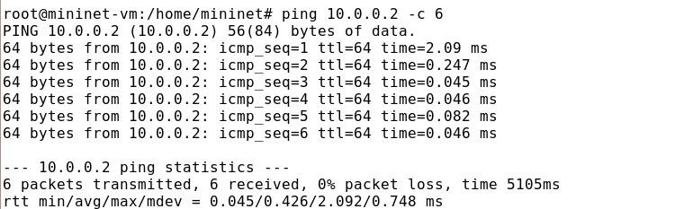{width=80% height=80% }

## Добавление задержки в эмулируемой глобальной сети

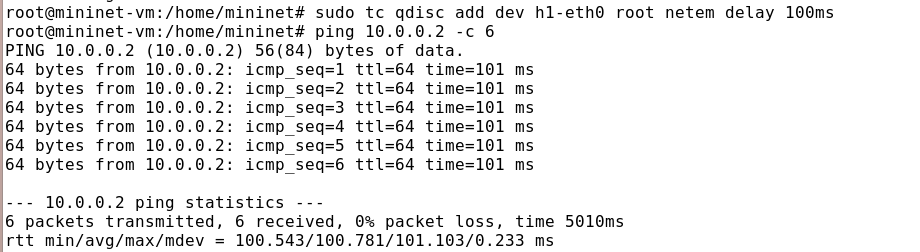{width=80% height=80%}

## Изменение задержки в эмулируемой глобальной сети

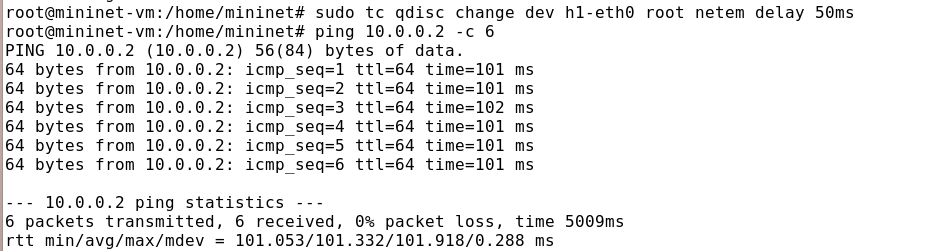{width=80% height=80%}

## Восстановление исходных значений (удаление правил) задержки в эмулируемой глобальной сети

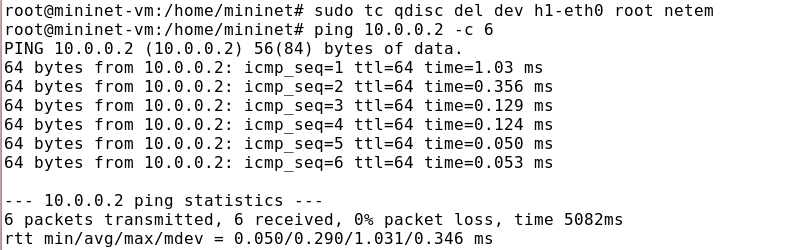{width=80% height=80%}

## Добавление значения дрожания задержки в интерфейс подключения к эмулируемой глобальной сети

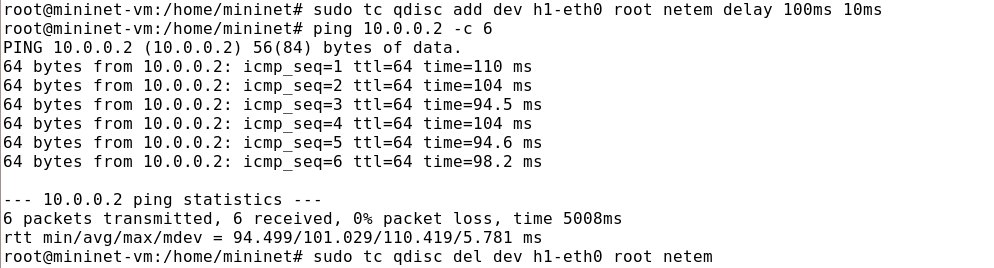{width=80% height=80%}

##  Добавление значения корреляции для джиттера и задержки в интерфейс подключения к эмулируемой глобальной сети

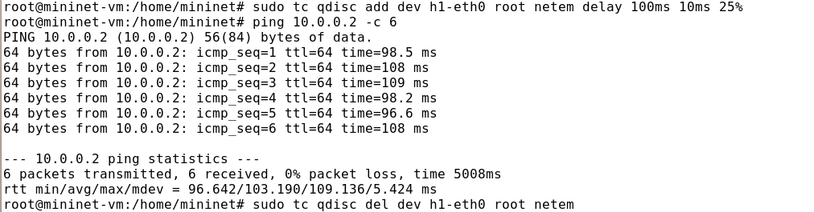{width=80% height=80%}

## Распределение задержки в интерфейсе подключения к эмулируемой глобальной сети

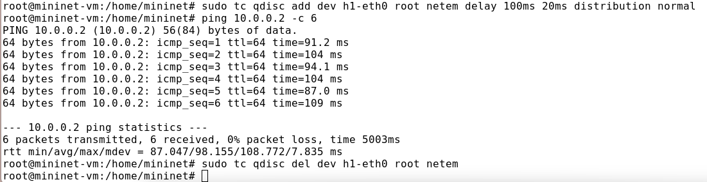{width=80% height=80%}

## Добавление задержки для интерфейса, подключающегося к эмулируемой глобальной сети

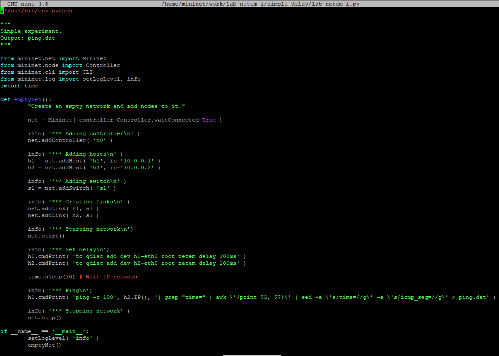{width=80% height=80%}

## Добавление задержки для интерфейса, подключающегося к эмулируемой глобальной сети

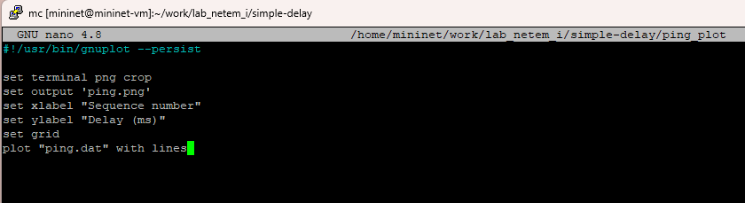{width=80% height=80%}

## Добавление задержки для интерфейса, подключающегося к эмулируемой глобальной сети

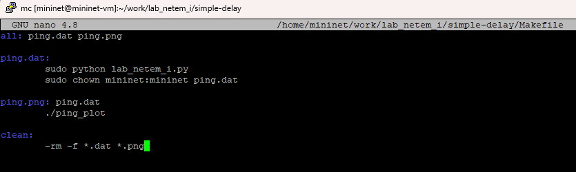{width=80% height=80%}

## Добавление задержки для интерфейса, подключающегося к эмулируемой глобальной сети

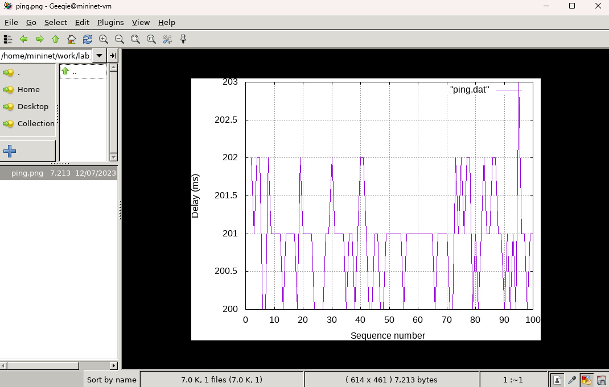{width=80% height=80%}

## Реализование воспроизводимые эксперименты по изменению задержки

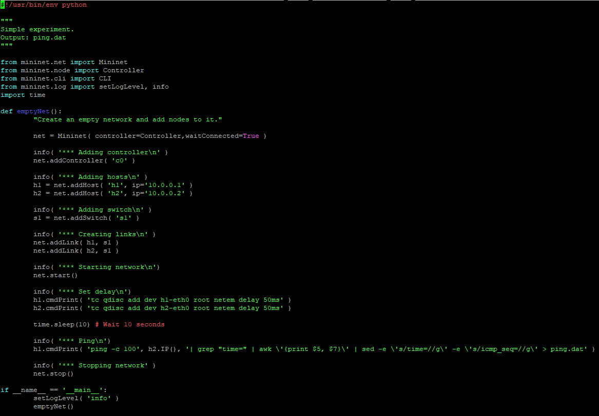{width=80% height=80%}

## Реализование воспроизводимые эксперименты по изменению задержки

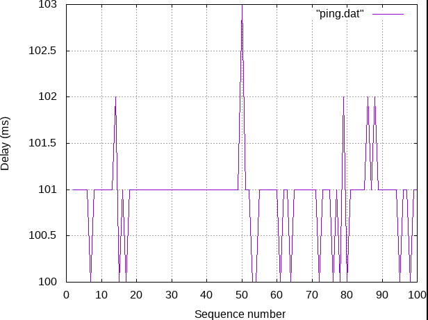{width=80% height=80%}

## Реализование воспроизводимые эксперименты по джиттера, значения корреляции для джиттера и задержки

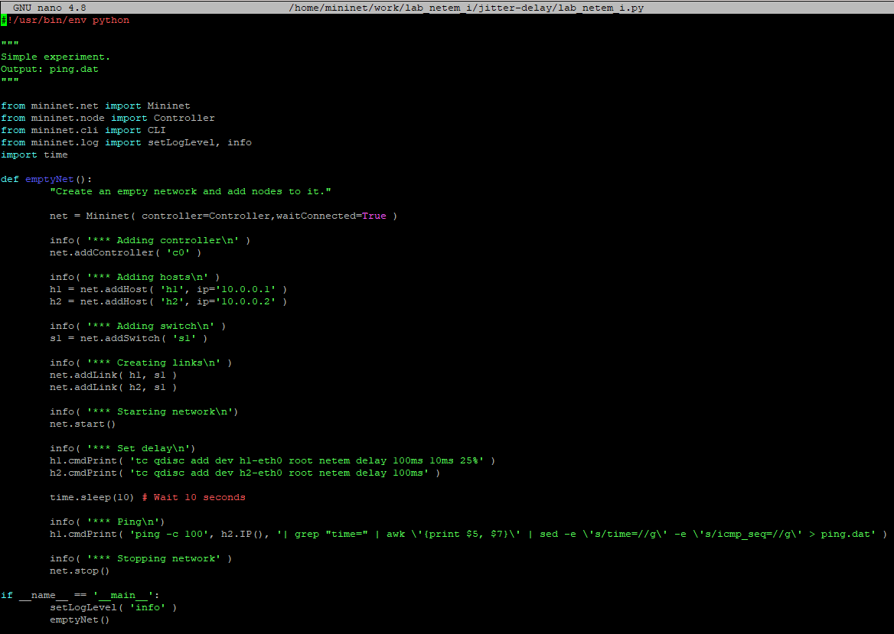{width=80% height=80%}

## Реализование воспроизводимые эксперименты по джиттера, значения корреляции для джиттера и задержки

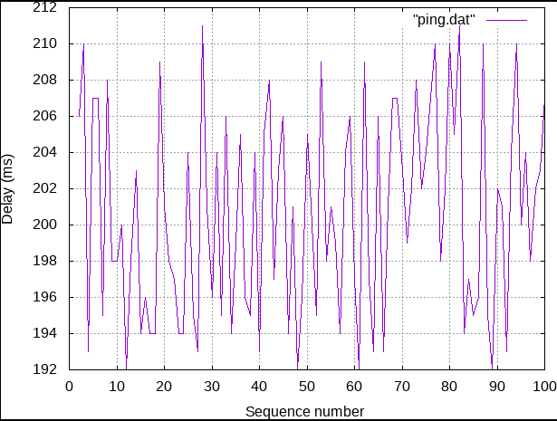{width=80% height=80%}

## Реализование воспроизводимые эксперименты распределение задержки

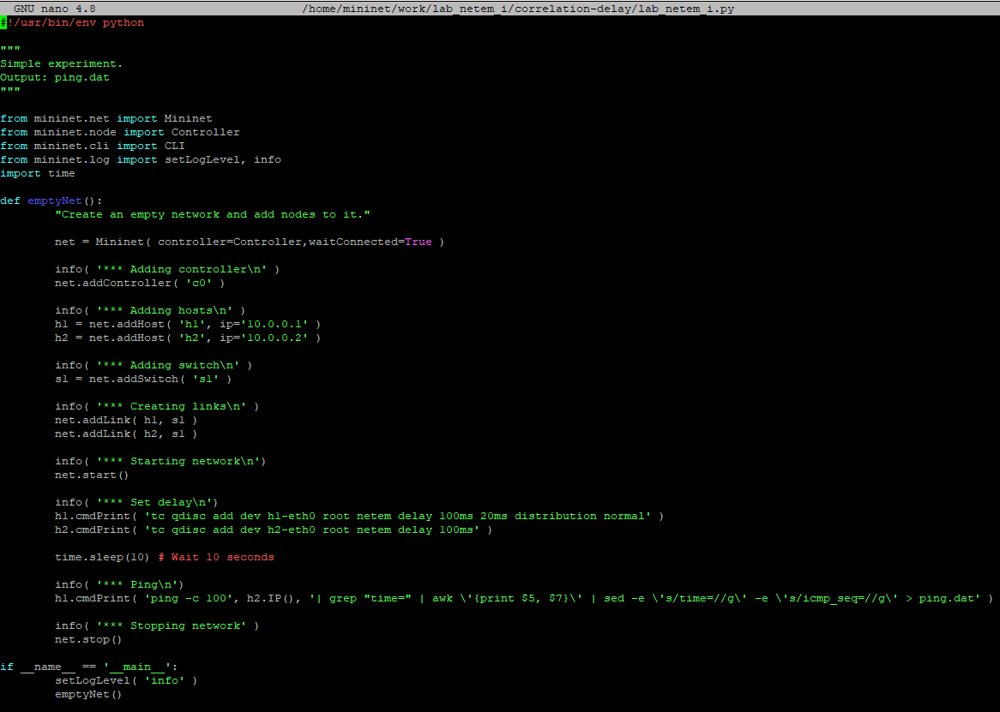{width=80% height=80%}

## Реализование воспроизводимые эксперименты распределение задержки

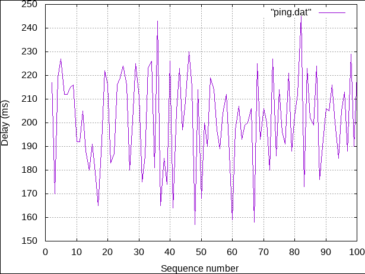{width=80% height=80%}

# Выводы по проделанной работе

## Вывод

Я познакомилась с NETEM — инструментом для тестирования производительности приложений в виртуальной сети, а также получение навыков проведения интерактивного и воспроизводимого экспериментов по измерению задержки и её дрожания (jitter) в моделируемой сети в среде Mininet.
