---
## Front matter
lang: ru-RU
title: Лабораторная работа №5
subtitle:  Эмуляция и измерение потерь пакетов в глобальных сетях
author: |
	 Ким Реачна\inst{1}

institute: |
	\inst{1}Российский Университет Дружбы Народов

date: 14 декабря, 2023, Москва, Россия

## Formatting
mainfont: PT Serif
romanfont: PT Serif
sansfont: PT Sans
monofont: PT Mono
toc: false
slide_level: 2
theme: metropolis
header-includes: 
 - \metroset{progressbar=frametitle,sectionpage=progressbar,numbering=fraction}
 - '\makeatletter'
 - '\beamer@ignorenonframefalse'
 - '\makeatother'
aspectratio: 43
section-titles: true

---
# Цели и задачи

## Цель лабораторной работы

Основной целью работы является получение навыков проведения интерактивных экспериментов в среде Mininet по исследованию параметров сети, связанных с потерей, дублированием, изменением порядка и повреждением пакетов при передаче данных. Эти параметры влияют на производительность протоколов и сетей.

## Задание

1. Задайте простейшую топологию, состоящую из двух хостов и коммутатора с назначенной по умолчанию mininet сетью 10.0.0.0/8.
2. Проведите интерактивные эксперименты по по исследованию параметров сети, связанных с потерей, дублированием, изменением порядка и повреждением пакетов при передаче данных.
3. Реализуйте воспроизводимый эксперимент по добавлению правила отбрасывания пакетов в эмулируемой глобальной сети. На экран выведите сводную информацию о потерянных пакетах.
4. Самостоятельно реализуйте воспроизводимые эксперименты по исследованию параметров сети, связанных с потерей, изменением порядка и повреждением пакетов при передаче данных. 

# Процесс выполнения лабораторной работы

## Запуск лабораторной топологии

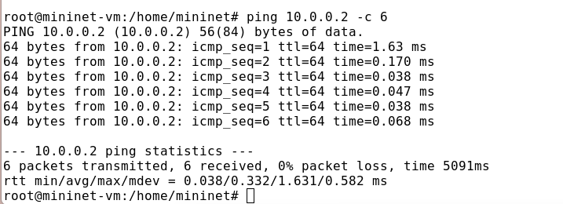{width=80% height=80%}

## Добавление потери пакетов на интерфейс, подключённый к эмулируемой глобальной сети

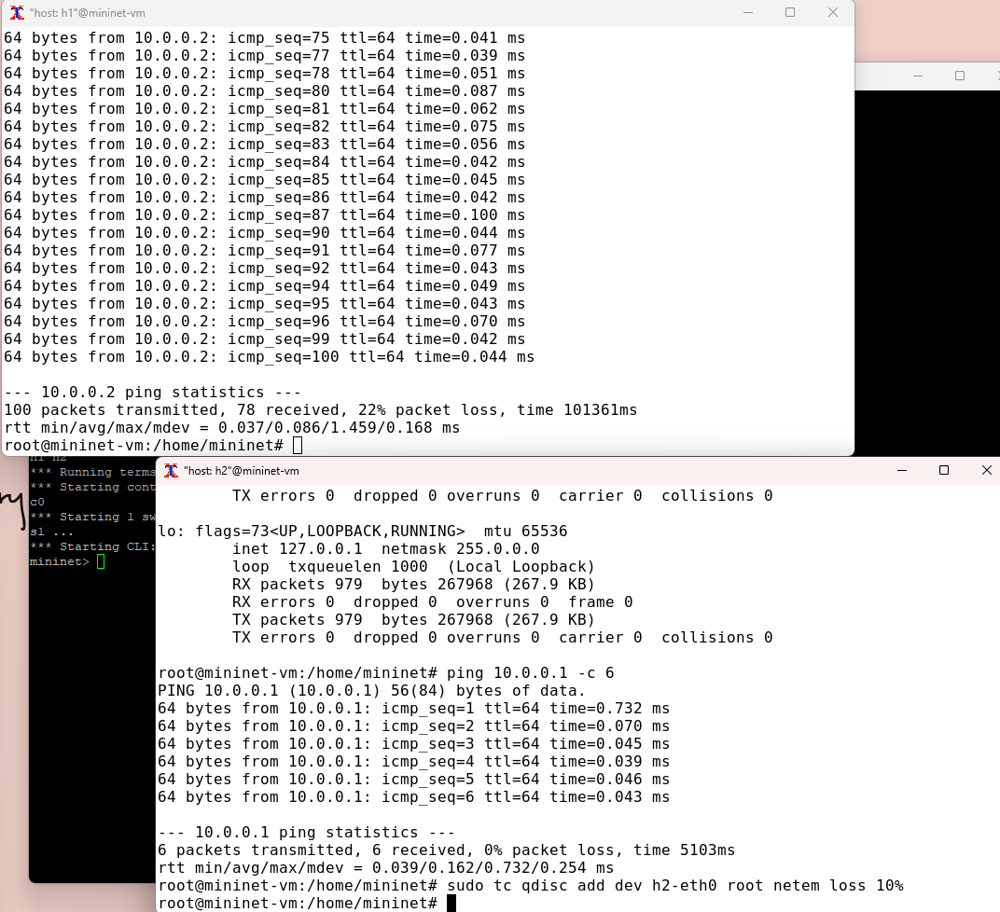{width=80% height=80%}

## Добавление значения корреляции для потери пакетов в эмулируемой глобальной сети

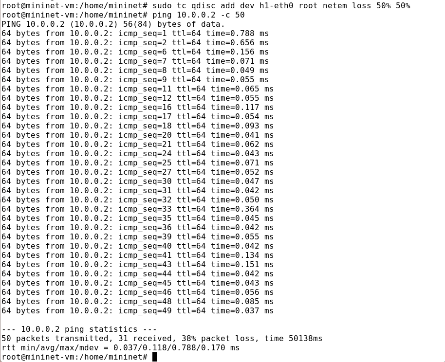{width=80% height=80%}

## Добавление повреждения пакетов в эмулируемой глобальной сети

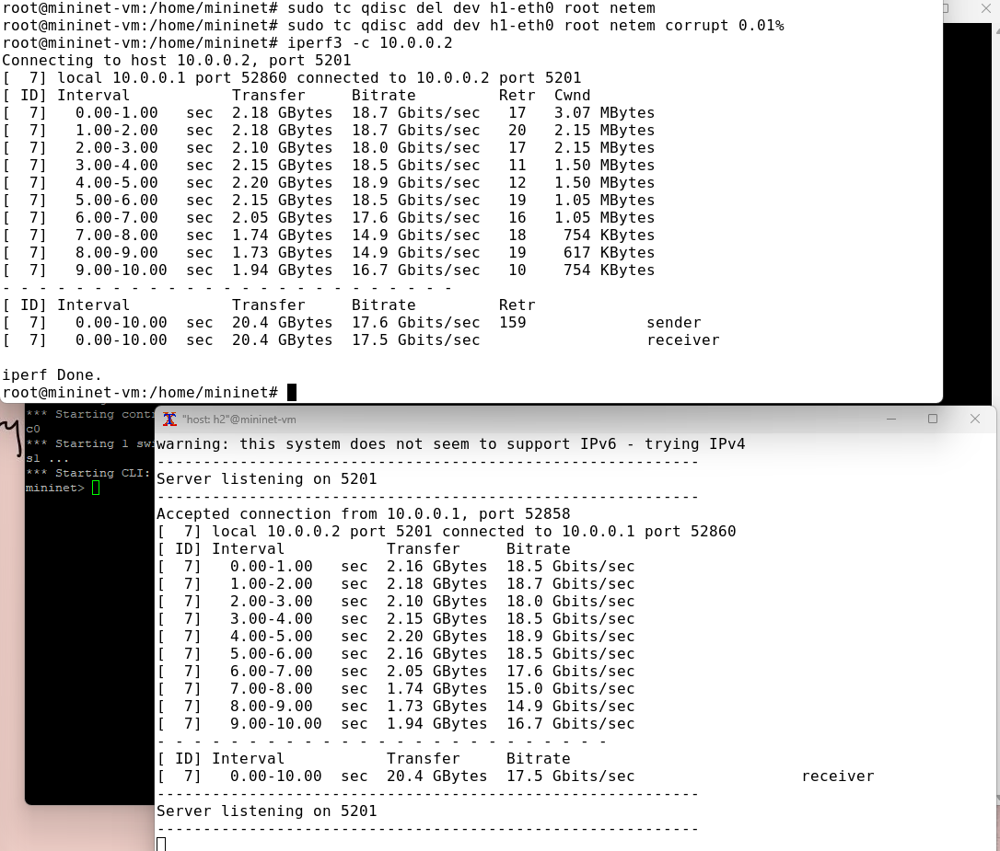{width=80% height=80%}

## Добавление переупорядочивания пакетов в интерфейс подключения к эмулируемой глобальной сети

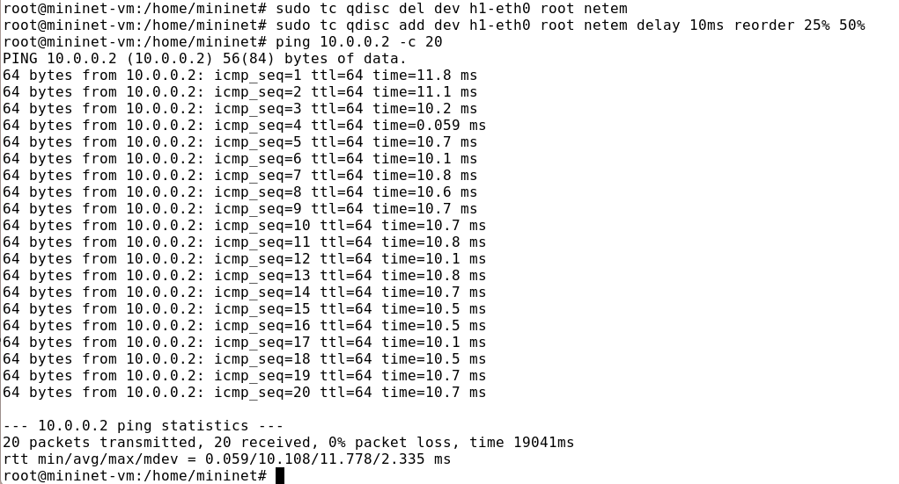{width=80% height=80%}

## Добавление дублирования пакетов в интерфейс подключения к эмулируемой глобальной сети

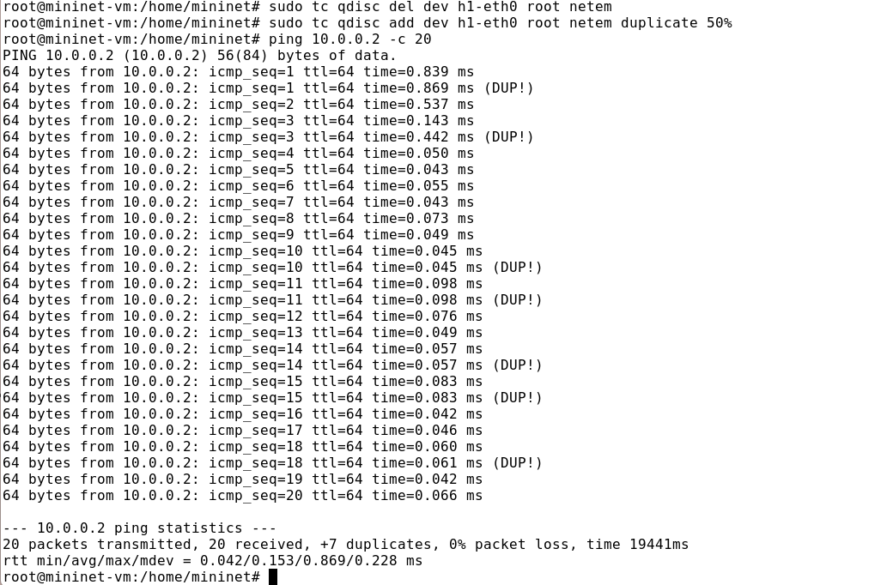{width=80% height=80%}

## Воспроизведение экспериментов

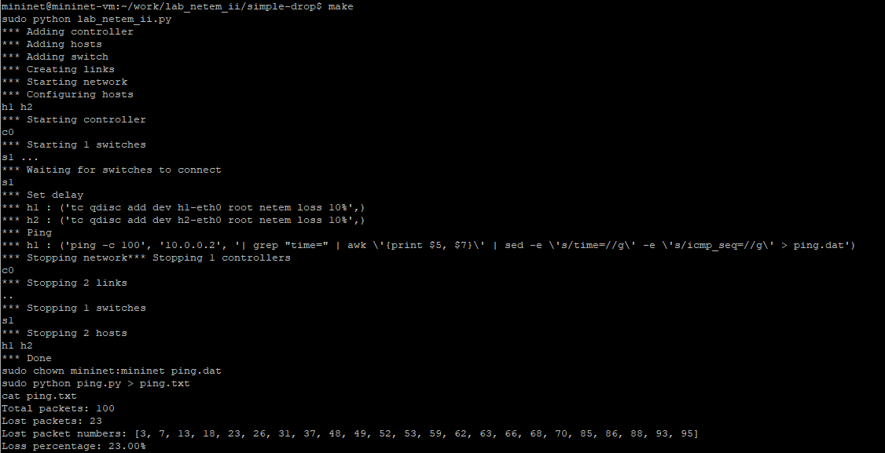{width=80% height=80%}

## Воспроизведение экспериментов - добавление значения корреляции

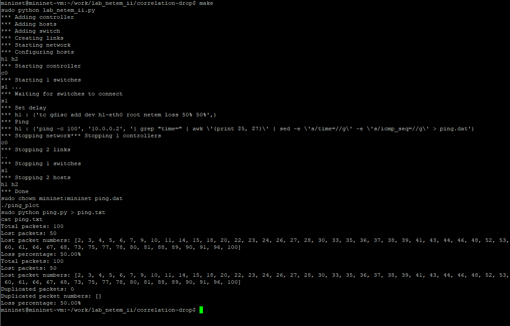{width=80% height=80%}

## Воспроизведение экспериментов - добавление повреждения пакетов

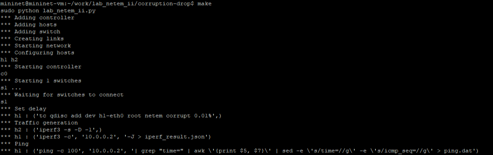{width=80% height=80%}

## Воспроизведение экспериментов - добавление переупорядочивания пакетов

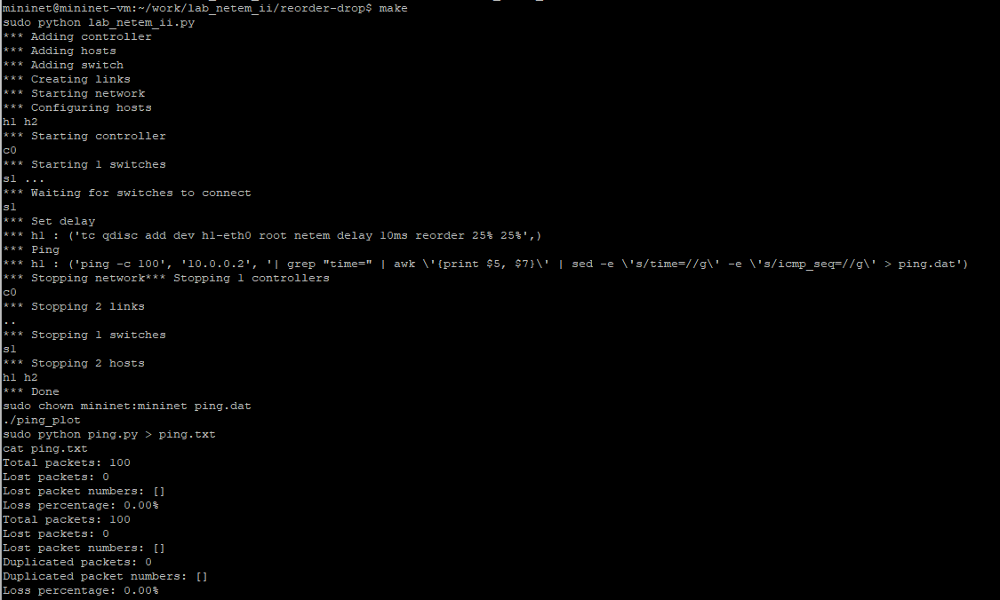{width=80% height=80%}

## Воспроизведение экспериментов - добавление дублирования пакетов

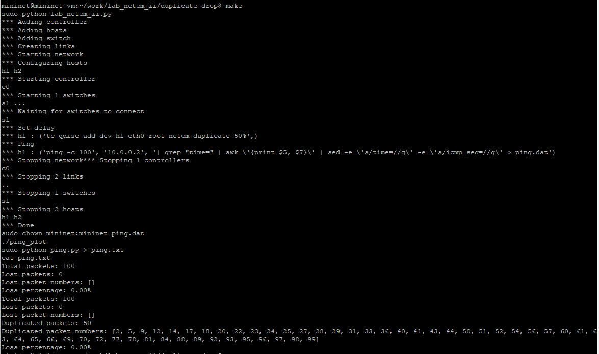{width=80% height=80%}

# Выводы по проделанной работе

## Вывод

Получила навыков проведения интерактивных экспериментов в среде Mininet по исследованию параметров сети, связанных с потерей, дублированием, изменением порядка и повреждением пакетов при передаче данных. Эти параметры влияют на производительность протоколов и сетей.
