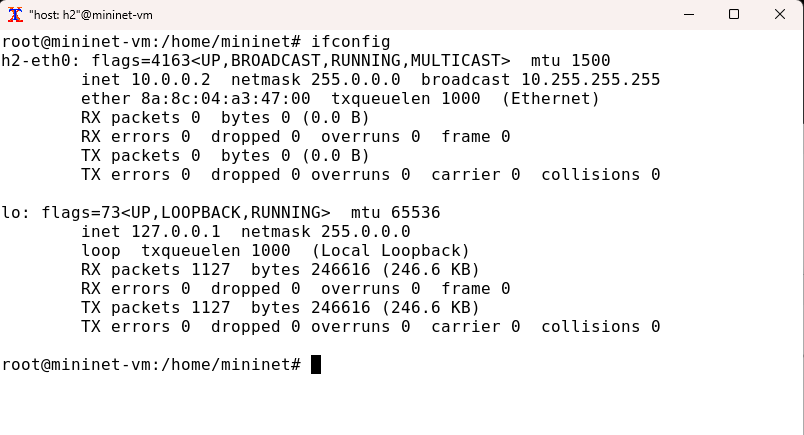
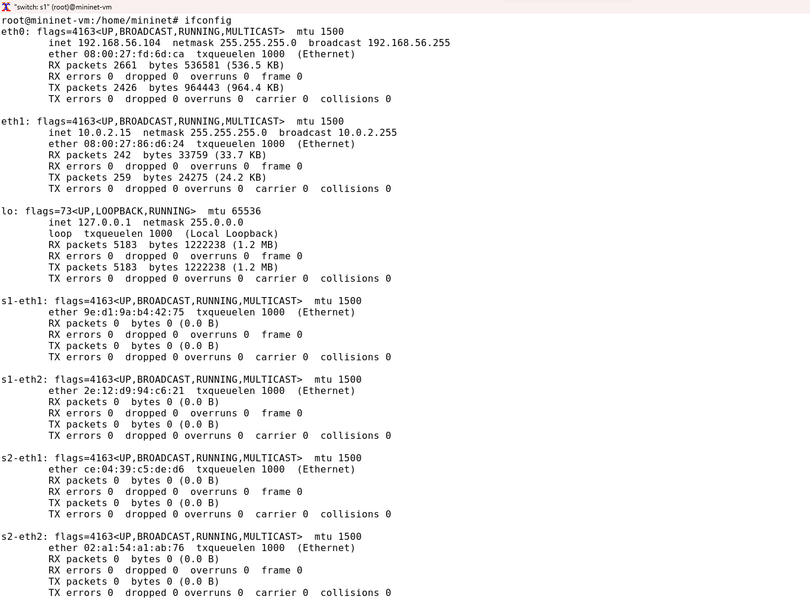
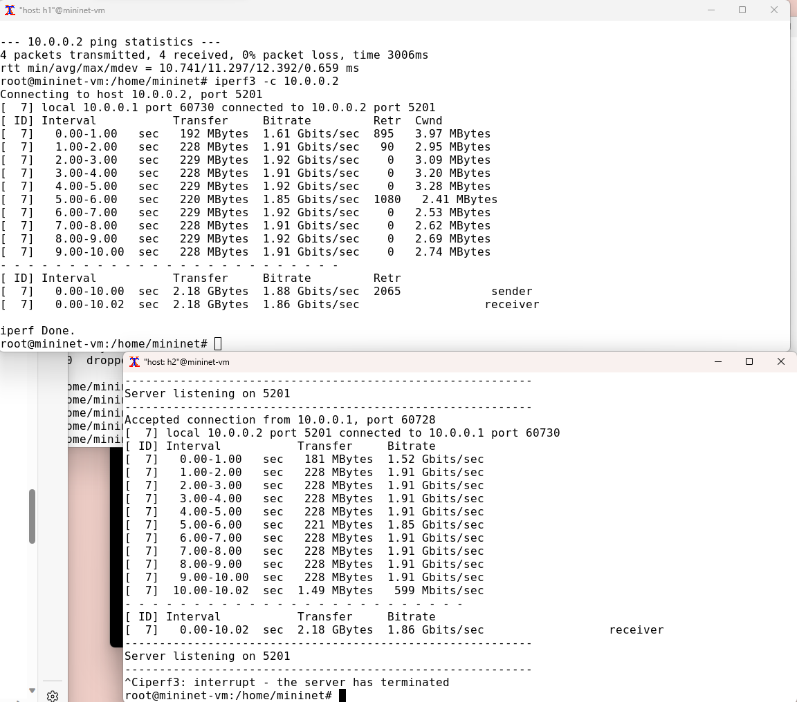
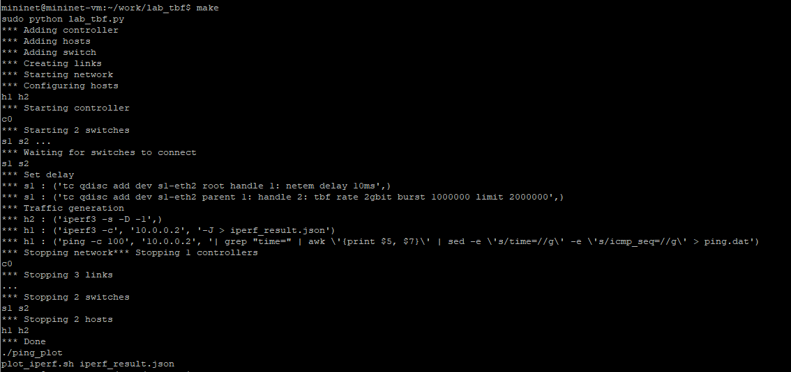
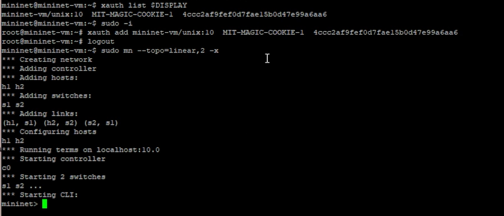

---
## Front matter
lang: ru-RU
title: Лабораторная работа №2
subtitle:  Структуры данных
author: |
	 Ким Реачна\inst{1}

institute: |
	\inst{1}Российский Университет Дружбы Народов

date: 17 ноября, 2023, Москва, Россия

## Formatting
mainfont: PT Serif
romanfont: PT Serif
sansfont: PT Sans
monofont: PT Mono
toc: false
slide_level: 2
theme: metropolis
header-includes: 
 - \metroset{progressbar=frametitle,sectionpage=progressbar,numbering=fraction}
 - '\makeatletter'
 - '\beamer@ignorenonframefalse'
 - '\makeatother'
aspectratio: 43
section-titles: true

---
# Цели и задачи

## Цель лабораторной работы

Основная цель работы — изучить несколько структур данных, реализованных в Julia, научиться применять их и операции над ними для решения задач.

## Задание

1. Используя Jupyter Lab, повторите примеры.
2. Выполните задания для самостоятельной работы.

# Процесс выполнения лабораторной работы

## Операции с кортежами

{width=80% height=80% }

## Операции со словарями

{width=80% height=80% }

## Операции со множествами

{width=80% height=80% }

## Операции со массивами

{width=80% height=80% }

## Операции со массивами

{width=70% height=70% }

# Выводы по проделанной работе

## Вывод

Изучила несколько структур данных, реализованных в Julia, научиться применять их и операции над ними для решения задач.
