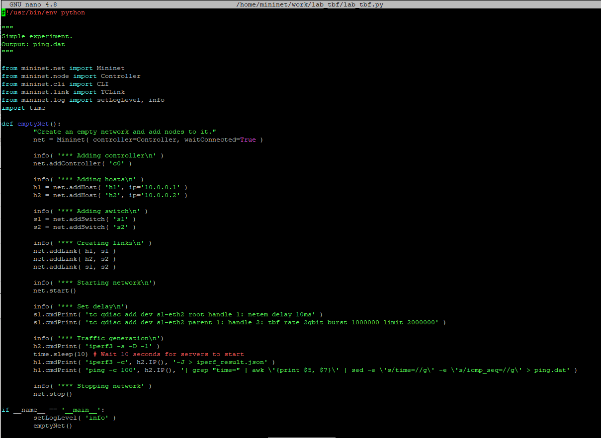

---
## Front matter
lang: ru-RU
title: Лабораторная работа №6
subtitle:  Настройка пропускной способности глобальной сети с помощью Token Bucket Filter
author: |
	 Ким Реачна\inst{1}

institute: |
	\inst{1}Российский Университет Дружбы Народов

date: 21 декабрь, 2023, Москва, Россия

## Formatting
mainfont: PT Serif
romanfont: PT Serif
sansfont: PT Sans
monofont: PT Mono
toc: false
slide_level: 2
theme: metropolis
header-includes: 
 - \metroset{progressbar=frametitle,sectionpage=progressbar,numbering=fraction}
 - '\makeatletter'
 - '\beamer@ignorenonframefalse'
 - '\makeatother'
aspectratio: 43
section-titles: true

---
# Цели и задачи

## Цель лабораторной работы

Основной целью работы является знакомство с принципами работы дисциплины очереди Token Bucket Filter, которая формирует входящий/исходящий трафик для ограничения пропускной способности, а также получение навыков моделирования и исследования поведения трафика посредством проведения интерактивного и воспроизводимого экспериментов в Mininet.

## Задание

1. Задайте топологию (рис. 6.3), состоящую из двух хостов и двух коммутаторов с назначенной по умолчанию mininet сетью 10.0.0.0/8.

2. Проведите интерактивные эксперименты по ограничению пропускной способности сети с помощью TBF в эмулируемой глобальной сети.

3. Самостоятельно реализуйте воспроизводимые эксперимент по применению TBF для ограничения пропускной способности. Постройте соответствующие графики.

# Процесс выполнения лабораторной работы

## Запуск лабораторной топологии

{width=70% height=70%}

## Запуск лабораторной топологии

{width=70% height=70%}

## Ограничение скорости на конечных хостах

{width=70% height=70%}

## Ограничение скорости на коммутаторах

{width=70% height=70%}

## Ограничение скорости на коммутаторах

{width=70% height=70%}

##  Объединение NETEM и TBF

{width=70% height=70%}

##  Объединение NETEM и TBF

{width=70% height=70%}

## Воспроизводимые эксперименты

{width=70% height=70%}

## Воспроизводимые эксперименты

{width=70% height=70%}

# Выводы по проделанной работе

## Вывод

Я познакомилась с принципами работы дисциплины очереди Token Bucket Filter, которая формирует входящий/исходящий трафик для ограничения пропускной способности, а также получение навыков моделирования и исследования поведения трафика посредством проведения интерактивного и воспроизводимого экспериментов в Mininet.