---
## Front matter
title: "Отчёт по лабораторной работе №6"
subtitle: "Настройка пропускной способности глобальной сети с помощью Token Bucket Filter"
author: "Ким Реачна"

## Generic otions
lang: ru-RU
toc-title: "Содержание"

## Bibliography
bibliography: bib/cite.bib
csl: pandoc/csl/gost-r-7-0-5-2008-numeric.csl

## Pdf output format
toc: true # Table of contents
toc-depth: 2
lof: true # List of figures
fontsize: 12pt
linestretch: 1.5
papersize: a4
documentclass: scrreprt
## I18n polyglossia
polyglossia-lang:
  name: russian
  options:
	- spelling=modern
	- babelshorthands=true
polyglossia-otherlangs:
  name: english
## I18n babel
babel-lang: russian
babel-otherlangs: english
## Fonts
mainfont: PT Serif
romanfont: PT Serif
sansfont: PT Sans
monofont: PT Mono
mainfontoptions: Ligatures=TeX
romanfontoptions: Ligatures=TeX
sansfontoptions: Ligatures=TeX,Scale=MatchLowercase
monofontoptions: Scale=MatchLowercase,Scale=0.9
## Biblatex
biblatex: true
biblio-style: "gost-numeric"
biblatexoptions:
  - parentracker=true
  - backend=biber
  - hyperref=auto
  - language=auto
  - autolang=other*
  - citestyle=gost-numeric
## Pandoc-crossref LaTeX customization
figureTitle: "Рис."
listingTitle: "Листинг"
lofTitle: "Список иллюстраций"
lolTitle: "Листинги"
## Misc options
indent: true
header-includes:
  - \usepackage{indentfirst}
  - \usepackage{float} # keep figures where there are in the text
  - \floatplacement{figure}{H} # keep figures where there are in the text
---

# Цель работы

Основной целью работы является знакомство с принципами работы дисциплины очереди Token Bucket Filter, которая формирует входящий/исходящий трафик для ограничения пропускной способности, а также получение навыков моделирования и исследования поведения трафика посредством проведения интерактивного и воспроизводимого экспериментов в Mininet.

# Выполнение лабораторной работы

1. Запустила виртуальную среду с mininet и исправила права запуска X-соединения.

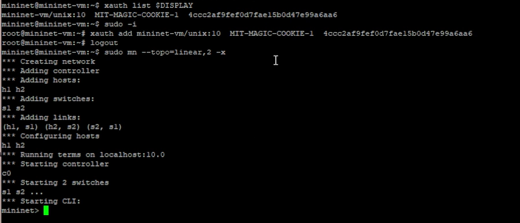{width=70% height=70%}

2. Задала топологию сети, отображать информацию с помощью ifconfig на хостах h1, h2 и коммутаторах s1 и s2 и проверка соединения между хостами

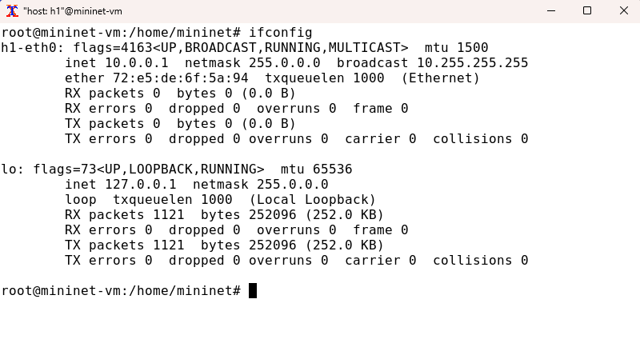{width=70% height=70%}

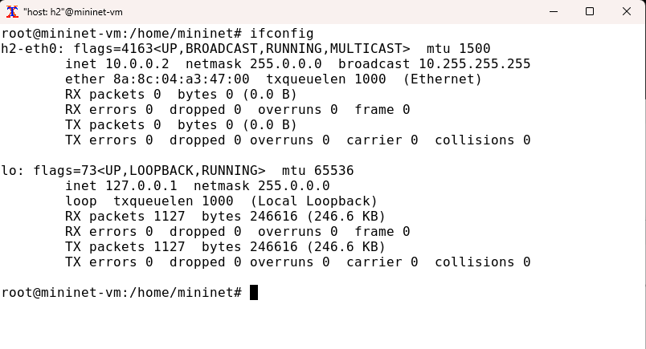{width=70% height=70%}

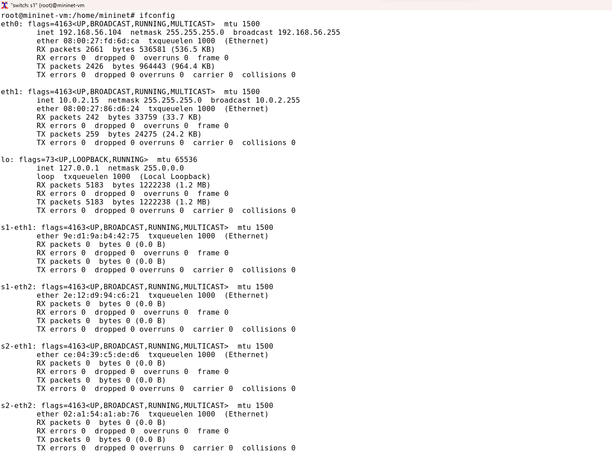{width=70% height=70%}

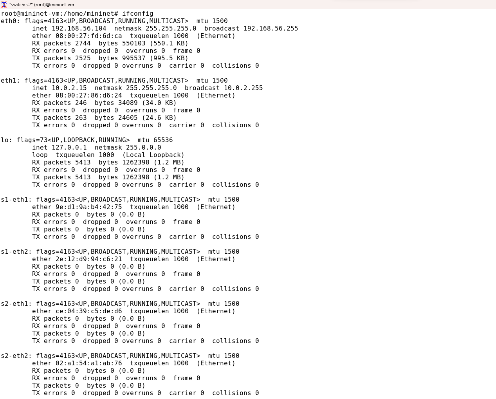{width=70% height=70%}

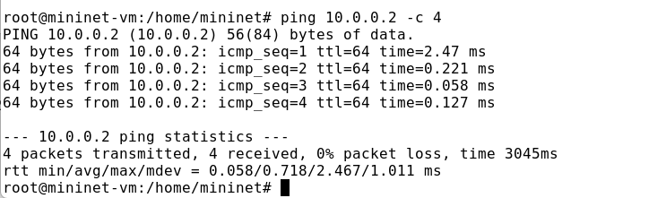{width=70% height=70%}

3. Запустила iPerf3

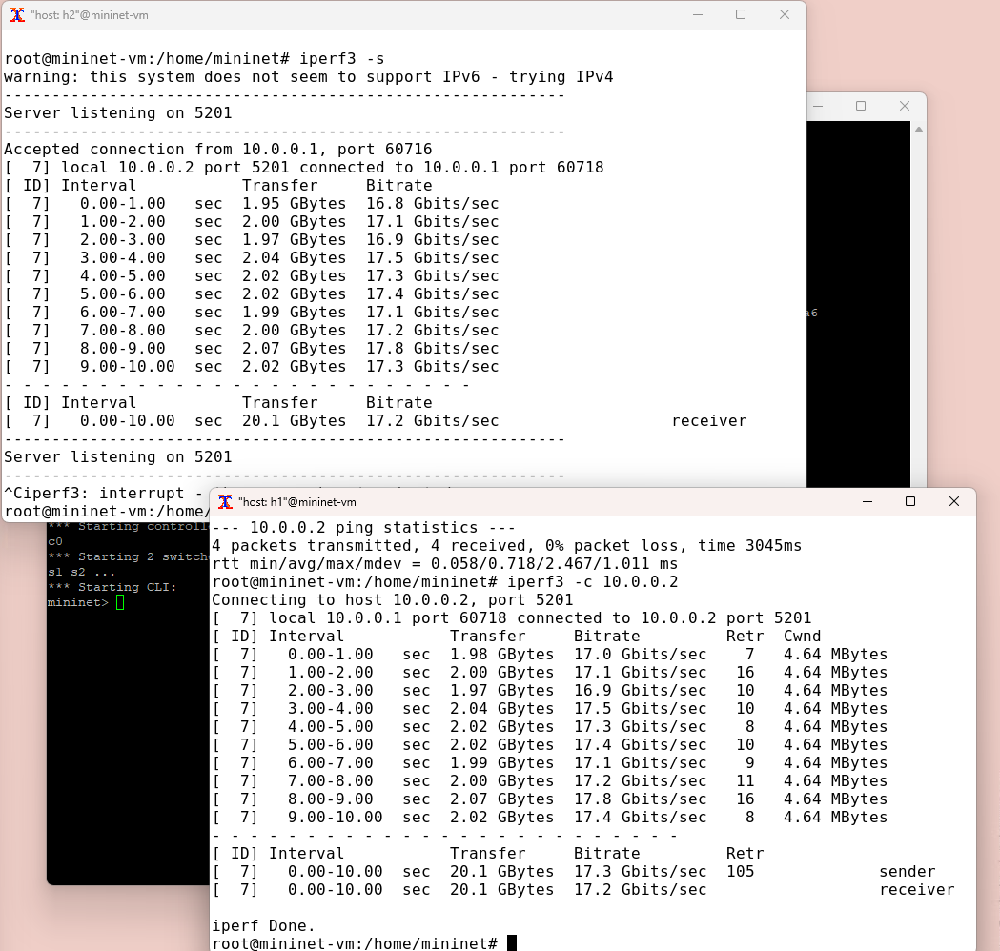{width=70% height=70%}

4. Измените ограничение скорости  на конечных хостах
и запуск iperf3 для проверки

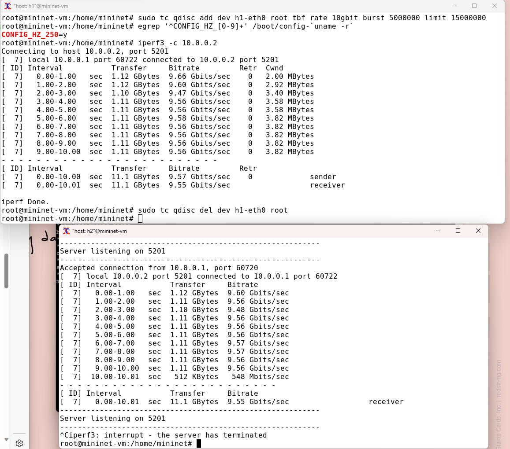{width=70% height=70%}

5. Измените ограничение скорости на коммутаторах и запуск iperf3 для проверки:

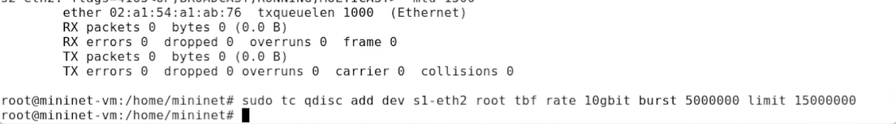{width=70% height=70%}

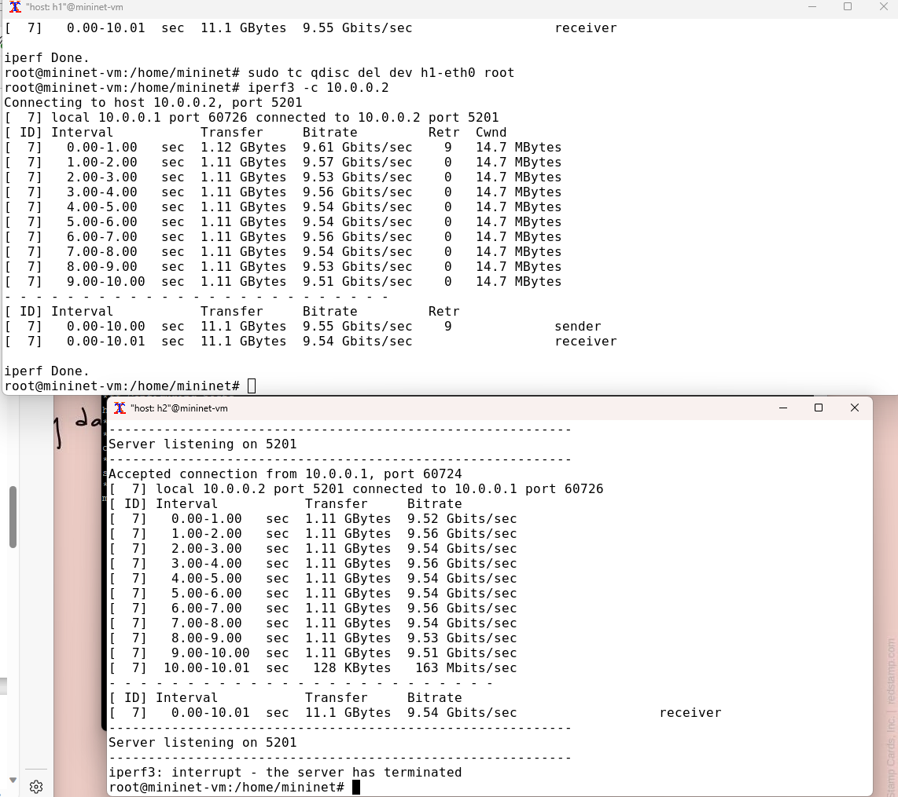{width=70% height=70%}

6. Объединение NETEM и TBF на коммутаторе s1 и проверки соединение от хоста h1 к хосту h2 с помощью команды ping с параметром -c 4:

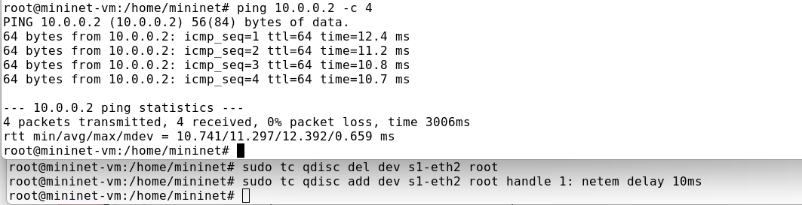{width=70% height=70%}

7. Добавление второе правило на коммутаторе s1 и запуск iperf3 для проверки:

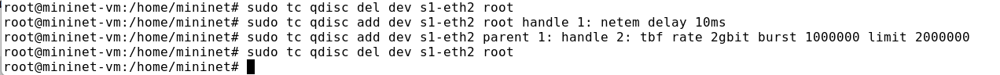{width=70% height=70%}

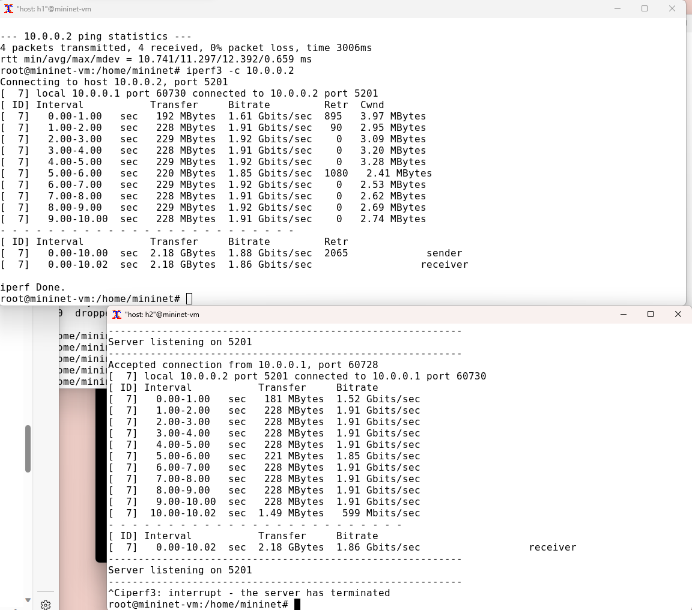{width=70% height=70%}

8. Реализации воспроизводимых экспериментов по использованию TBF для ограничения пропускной способности:

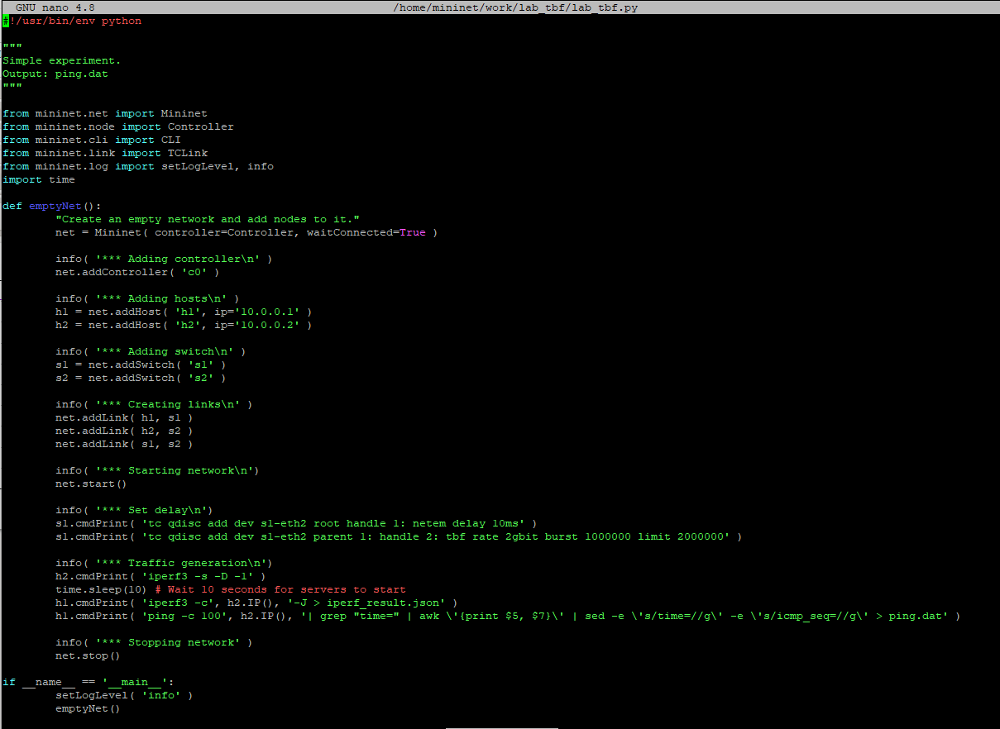{width=70% height=70%}

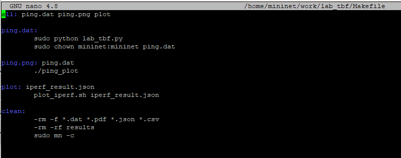{width=70% height=70%}

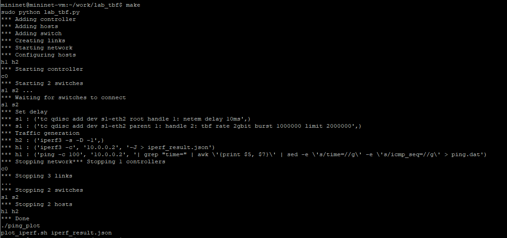{width=70% height=70%}

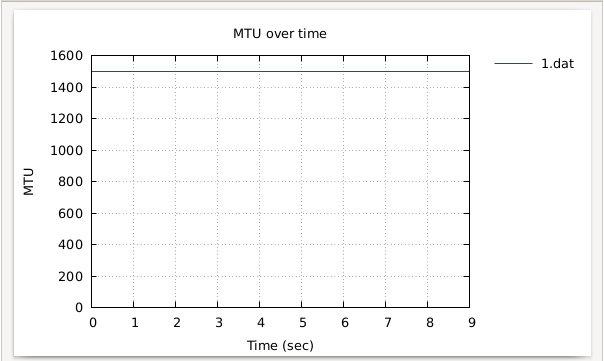{width=70% height=70%}

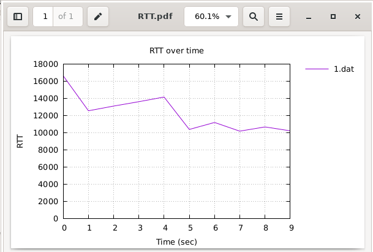{width=70% height=70%}

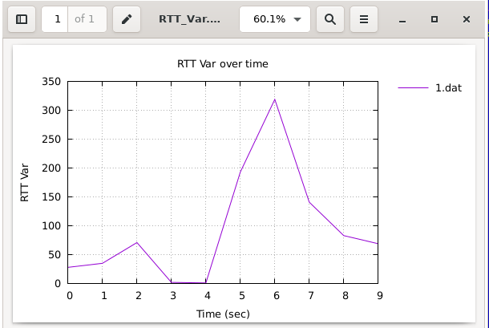{width=70% height=70%}

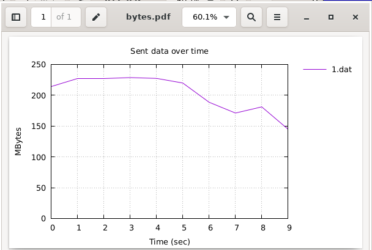{width=70% height=70%}

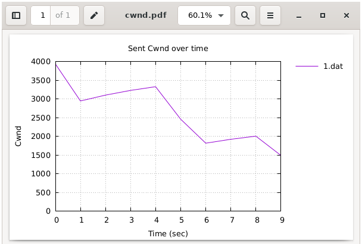{width=70% height=70%}

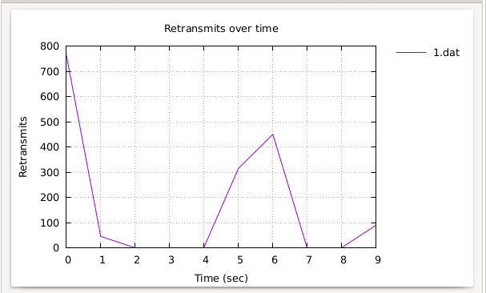{width=70% height=70%}

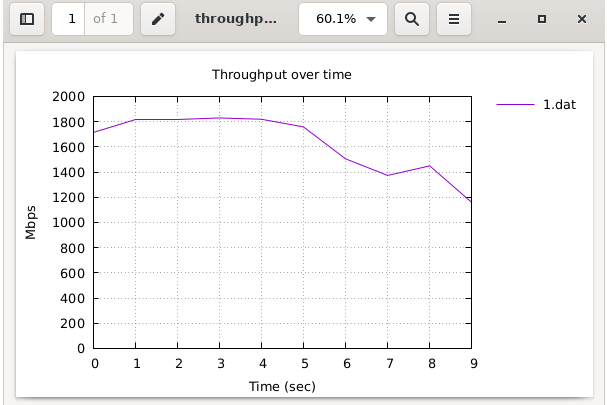{width=70% height=70%}

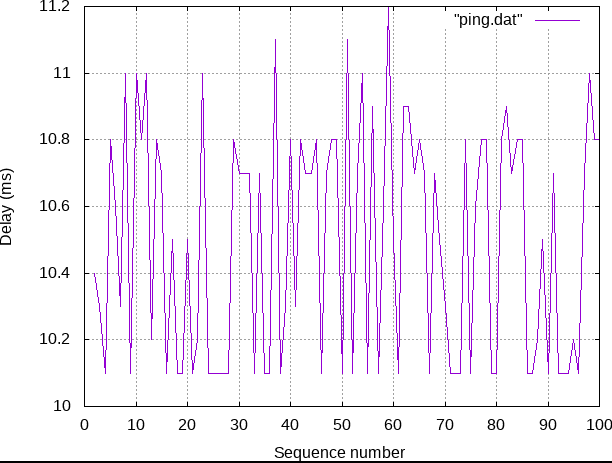{width=70% height=70%}

# Листинги  программы

- Скрипт lab_tbf.py

```python
#!/usr/bin/env python

"""
Simple experiment.
Output: ping.dat
"""

from mininet.net import Mininet
from mininet.node import Controller
from mininet.cli import CLI
from mininet.link import TCLink
from mininet.log import setLogLevel, info
import time

def emptyNet():
        "Create an empty network and add nodes to it."
        net = Mininet( controller=Controller, waitConnected=True )

        info( '*** Adding controller\n' )
        net.addController( 'c0' )

        info( '*** Adding hosts\n' )
        h1 = net.addHost( 'h1', ip='10.0.0.1' )
        h2 = net.addHost( 'h2', ip='10.0.0.2' )

        info( '*** Adding switch\n' )
        s1 = net.addSwitch( 's1' )
        s2 = net.addSwitch( 's2' )

        info( '*** Creating links\n' )
        net.addLink( h1, s1 )
        net.addLink( h2, s2 )
        net.addLink( s1, s2 )

        info( '*** Starting network\n')
        net.start()

        info( '*** Set delay\n')
        s1.cmdPrint( 'tc qdisc add dev s1-eth2 root handle 1: netem delay 10ms')
        s1.cmdPrint( 'tc qdisc add dev s1-eth2 parent 1: handle 2: 
        tbf rate 2gbit burst 1000000 limit 2000000' )

        info( '*** Traffic generation\n')
        h2.cmdPrint( 'iperf3 -s -D -1' )
        time.sleep(10) # Wait 10 seconds for servers to start
        h1.cmdPrint( 'iperf3 -c', h2.IP(), '-J > iperf_result.json' )
        h1.cmdPrint( 'ping -c 100', h2.IP(), '| grep "time=" | 
        awk \'{print $5, $7}\' | sed -e \'s/time=//g\' -e \'s/icmp_seq=//g\' > ping.dat' )

        info( '*** Stopping network' )
        net.stop()

if __name__ == '__main__':
        setLogLevel( 'info' )
        emptyNet()
```

- Скрипт Makefile

```txt
all: ping.dat ping.png plot

ping.dat:
        sudo python lab_tbf.py
        sudo chown mininet:mininet ping.dat

ping.png: ping.dat
        ./ping_plot

plot: iperf_result.json
        plot_iperf.sh iperf_result.json

clean:
        -rm -f *.dat *.pdf *.json *.csv
        -rm -rf results
        sudo mn -c
```

# Вывод

Я познакомилась с принципами работы дисциплины очереди Token Bucket Filter, которая формирует входящий/исходящий трафик для ограничения пропускной способности, а также получение навыков моделирования и исследования поведения трафика посредством проведения интерактивного и воспроизводимого экспериментов в Mininet.